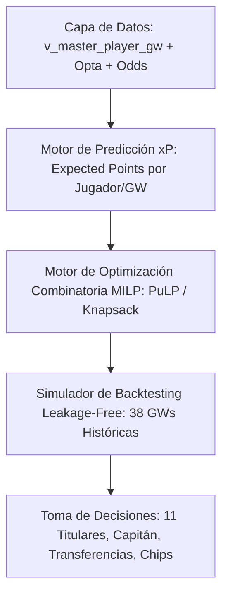

# Especificación del Agente Autónomo de FPL: Reglas 2025/2026, Marco Estadístico y Entorno de Backtesting

> **Documento de Arquitectura y Estrategia FPL v1.0**  
> Proyecto: `mova-pro-futbol-data-analytics` | Vertical: **MOVA** (Orbital Lab)

---

## 1. Visión Estratégica del Agente Autónomo FPL

El objetivo del agente **FPL-Autonomous-Agent** es competir de forma 100% independiente en la **Fantasy Premier League (FPL)** apuntando al **Top 0.1% Global (Top 1K / Top 10K)**.

Para lograrlo, el agente no confía en corazonadas ni opiniones de redes sociales; opera mediante un pipeline cuantitativo tripartito:

---

## 2. Reglamento Cuantitativo Oficial FPL (Temporada 2025 / 2026)

### 2.1 Restricciones de Composición de Plantilla
- **Presupuesto Inicial:** £100.0M (£1000 en unidades internas de la API, donde 1 unidad = £0.1M).
- **Tamaño de Plantilla:** 15 jugadores exactos.
- **Distribución por Posición:**
  - 2 Porteros (GKP - `element_type = 1`)
  - 5 Defensas (DEF - `element_type = 2`)
  - 5 Mediocampistas (MID - `element_type = 3`)
  - 3 Delanteros (FWD - `element_type = 4`)
- **Límite por Club:** Máximo **3 jugadores** del mismo equipo de la Premier League.

---

### 2.2 Matriz Oficial de Puntuación por Acción

| Acción / Evento | Portero (GKP) | Defensa (DEF) | Mediocampista (MID) | Delantero (FWD) |
| :--- | :---: | :---: | :---: | :---: |
| **Jugar 1 a 59 minutos** | +1 pt | +1 pt | +1 pt | +1 pt |
| **Jugar 60+ minutos** | +2 pts | +2 pts | +2 pts | +2 pts |
| **Gol marcado** | +6 pts | +6 pts | +5 pts | +4 pts |
| **Asistencia de gol** | +3 pts | +3 pts | +3 pts | +3 pts |
| **Clean Sheet** (Arco en cero, min $\ge 60$) | +4 pts | +4 pts | +1 pt | 0 pts |
| **Atajadas** (por cada 3 atajadas) | +1 pt | N/A | N/A | N/A |
| **Penalti parado** | +5 pts | N/A | N/A | N/A |
| **Penalti fallado** | -2 pts | -2 pts | -2 pts | -2 pts |
| **Goles concedidos** (por cada 2 goles recibidos) | -1 pt | -1 pt | 0 pts | 0 pts |
| **Tarjeta amarilla** | -1 pt | -1 pt | -1 pt | -1 pt |
| **Tarjeta roja** (incluye acumulación de min) | -3 pts | -3 pts | -3 pts | -3 pts |
| **Autogol** | -2 pts | -2 pts | -2 pts | -2 pts |
| **Bonus Points System (BPS)** | Top 3 BPS del partido reciben **+3, +2, +1 pts** |

---

### 2.3 Reglas de Alineación, Capitán y Banca
- **Formaciones Válidas (11 Titulares):**
  - Porteros: Exactamente 1 GKP.
  - Defensas: Mínimo 3 DEF, Máximo 5 DEF.
  - Mediocampistas: Mínimo 2 MID, Máximo 5 MID.
  - Delanteros: Mínimo 1 FWD, Máximo 3 FWD.
  *(Formaciones comunes: 3-4-3, 3-5-2, 4-3-3, 4-4-2, 5-3-2, 5-4-1)*.
- **Capitán y Vice-Capitán:**
  - **Capitán (C):** Puntos multiplicados por 2x.
  - **Vice-Capitán (VC):** Asume el 2x únicamente si el Capitán elegido juega 0 minutos.
- **Sustituciones Automáticas de Banco:**
  - La banca se ordena con prioridad $[GKP_2, B_1, B_2, B_3]$.
  - Si un titular juega 0 minutos, es reemplazado automáticamente por el primer jugador de la banca que mantenga una formación válida.

---

### 2.4 Reglas de Transferencias (Actualización FPL 2024–2026)
- **Transferencias Gratis (Free Transfers - FT):**
  - Se otorga **1 FT gratis** por Gameweek.
  - **Acumulación de FTs (Novedad Regla 2024+):** Se pueden acumular hasta **5 FTs gratis** (anteriormente el límite era 2).
  - **Uso de Chips:** A partir de 2024/25, activar un *Wildcard* o *Free Hit* **NO elimina los FTs acumulados**; se conservan para la siguiente semana.
- **Costo de Transferencias Extra:** Cada transferencia adicional más allá de las FTs disponibles descuenta **-4 puntos** del total de la jornada (*Hit*).

---

### 2.5 Chips ("Poderes Especiales")
Cada chip puede activarse como máximo **1 vez por Gameweek**:

1. **Wildcard (2 por temporada):**
   - Wildcard 1 (GW1 a GW19) / Wildcard 2 (GW20 a GW38).
   - Permite realizar transferencias ilimitadas dentro del presupuesto sin costo de -4 puntos.
2. **Free Hit (1 por temporada):**
   - Realiza transferencias ilimitadas para una sola Gameweek. En la siguiente GW, la plantilla vuelve automáticamente al equipo original pre-Free Hit.
3. **Triple Captain (1 por temporada):**
   - El capitán multiplicará sus puntos por **3x** en lugar de 2x.
4. **Bench Boost (1 por temporada):**
   - Los 4 jugadores de la banca suman sus puntos al puntaje total de la jornada (juegan los 15 miembros de la plantilla).
5. **Mystery Chip (1 en la segunda mitad de la temporada):**
   - Chip introducido en la temporada 2024/25-2025/26 revelado en la GW19+.

---

## 3. Formulación Matemática de Optimización (MILP)

El agente resuelve un problema de **Programación Lineal Entera Mixta (Mixed-Integer Linear Programming - MILP)** cada jornada.

### Variables de Decisión
- $x_i \in \{0, 1\}$: 1 si el jugador $i$ está en la plantilla de 15, 0 si no.
- $s_i \in \{0, 1\}$: 1 si el jugador $i$ es titular (11), 0 si no.
- $c_i \in \{0, 1\}$: 1 si el jugador $i$ es capitán, 0 si no.
- $v_i \in \{0, 1\}$: 1 si el jugador $i$ es vice-capitán, 0 si no.
- $b_{i, k} \in \{0, 1\}$: 1 si el jugador $i$ ocupa el puesto $k$ de la banca.

### Función Objetivo: Maximizar Puntos Esperados ($xP$) netos de Hits
$$\max \sum_{i=1}^{N} \left( s_i \cdot xP_{i, t} + c_i \cdot xP_{i, t} \right) - 4 \cdot \text{Hits}_t$$

### Restricciones Principales
1. **Presupuesto:** $\sum_{i=1}^{N} x_i \cdot \text{cost}_i \le 1000$
2. **Tamaño de Plantilla:** $\sum_{i=1}^{N} x_i = 15$
3. **Distribución Posicional:**
   - $\sum_{i \in \text{GKP}} x_i = 2, \quad \sum_{i \in \text{DEF}} x_i = 5, \quad \sum_{i \in \text{MID}} x_i = 5, \quad \sum_{i \in \text{FWD}} x_i = 3$
4. **Límite por Club:** $\sum_{i \in \text{Club}_k} x_i \le 3 \quad \forall k \in \{1 \dots 20\}$
5. **Formación Titular:**
   - $\sum_{i=1}^{N} s_i = 11, \quad s_i \le x_i$
   - $1 \le \sum_{i \in \text{GKP}} s_i \le 1$
   - $3 \le \sum_{i \in \text{DEF}} s_i \le 5$
   - $2 \le \sum_{i \in \text{MID}} s_i \le 5$
   - $1 \le \sum_{i \in \text{FWD}} s_i \le 3$

---

## 4. Diseño del Simulador de Backtesting Leakage-Free

El motor de backtesting (`scripts/backtest_fpl.py`) funcionará de forma estrictamente secuencial:

1. **Barrera Temporal:** En la jornada $T$, el agente **SOLO** tiene acceso a la información disponible antes del deadline de la GW $T$ (puntos históricos $T-1$, cuotas pre-partido GW $T$, $xG/xA$ acumulados).
2. **Cálculo de $xP$:** Estimación de $xP_{i, T \dots T+k}$ para una ventana de planificación de 5 a 8 jornadas.
3. **Resolución MILP:** El optimizador selecciona la plantilla, transferencias, formación, capitán y chips.
4. **Ejecución y Registro:** Se aplican las sustituciones automáticas y se registra la puntuación real otorgada por la vista `v_master_player_gw`.
5. **Métrica Final:** Puntos totales acumulados en 38 jornadas vs. promedios globales de FPL y ranking estimado.
