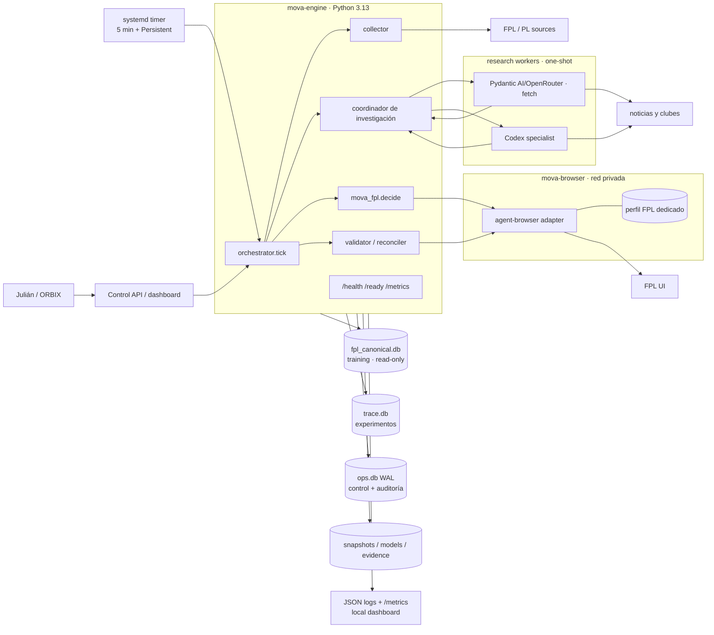
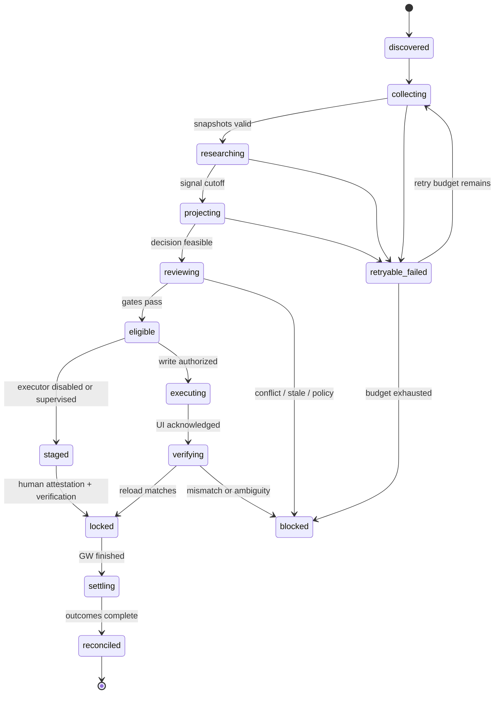
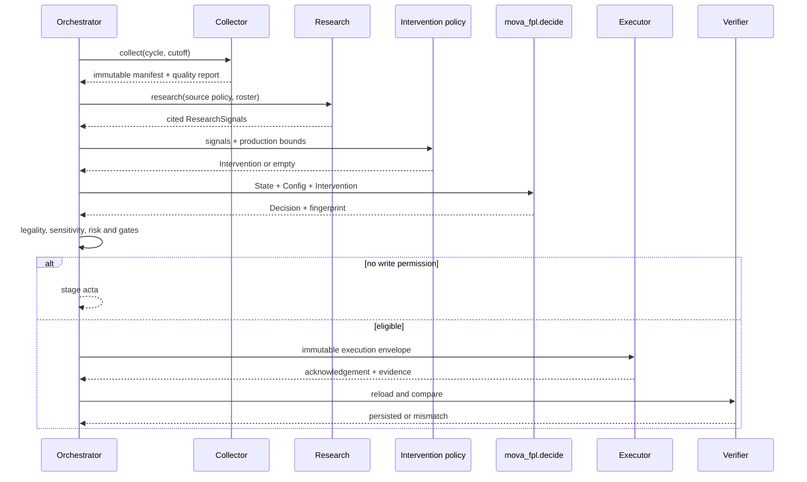

# Arquitectura

## Decisión resumida

Un temporizador `systemd` ejecuta cada cinco minutos un comando idempotente `tick`. El
orquestador obtiene un `flock` del host y una transacción `BEGIN IMMEDIATE` en SQLite,
calcula la próxima transición desde el deadline oficial y delega jobs. La arquitectura
objetivo usa cuatro roles de imagen para aislar responsabilidades:

- `mova-engine`: Python 3.13, CBC, collector, coordinador, modelos y optimizador. La
  misma imagen sirve al worker one-shot y a la API local de control/observabilidad. Incluye
  SQLite ≥3.51.3; no usa el 3.45.1 del host;
- `mova-research-openrouter`: one-shot Python sin acceso a DB/browser/FPL secrets; ejecuta
  HTTP/Firecrawl y Pydantic AI core sobre OpenRouter contra request packages sellados;
- `mova-research-codex`: one-shot Codex CLI, con auth dedicada y sin OpenRouter key, DB,
  browser o repo MOVA montado; devuelve un result package filtrado y validable;
- `mova-browser`: un único Chromium normal y headed, supervisado sobre display virtual y
  perfil persistente exclusivo. `agent-browser` se adjunta por CDP interno después del
  arranque; el acceso interactivo existe sólo por túnel SSH cuando se requiere login.

Tres SQLite locales separan almacén canónico, experimentos y operación. Volúmenes del VPS
conservan snapshots, modelos y evidencia por hash. Supabase no forma parte de este diagrama:
solo refleja hitos PM mediante un flujo externo al servicio.

## Contexto

La flecha `decision → executor` solo se habilita cuando modo, nivel y compliance gate lo
permiten. En `shadow`, el executor es `disabled`.

El diseño detallado del coordinador, contratos y selección de backend está en
[08-agentic-research-harness.md](08-agentic-research-harness.md). No se usa LangGraph: la
máquina exterior y el ledger actuales ya cubren persistencia, routing y reintentos.
La spec de implementación y los schemas máquina están en
[09-agent-harness-implementation-spec.md](09-agent-harness-implementation-spec.md).

## Fronteras

| Componente | Puede | No puede |
| --- | --- | --- |
| Collector | GET, validar, sellar snapshots | decidir o mutar FPL |
| Research | crear `ResearchSignal` citado | fabricar una `Decision` |
| Research backend | devolver `ResearchResult` contra schema | abrir `ops.db`, decidir fase o invocar executor |
| Intervention policy | convertir señales en `Intervention` válida | forzar salida del optimizador |
| `mova_fpl` | proyectar, optimizar, validar reglas | importar browser, scheduler, secretos u operación |
| Orchestrator | transicionar estado y aplicar gates | alterar la decisión deportiva |
| Executor | aplicar una decisión inmutable | improvisar jugadores o estrategia |
| Verifier | recargar y comparar | declarar éxito por un toast |
| `ops.db` | coordinar, auditar y alimentar dashboard | entrenar modelos o almacenar cookies/blobs |
| PM externo | actualizar hitos del proyecto en Supabase | participar en decisiones o salud runtime |

## Máquina de estados

Estados terminales por ciclo: `reconciled`, `blocked`, `cancelled`, `superseded`. Una nueva
decisión no sobrescribe otra: crea revisión nueva y marca la anterior `superseded`.

## Ventanas relativas al deadline

El bootstrap decide `T`. La configuración por defecto es:

| Ventana | Trabajo |
| --- | --- |
| T-7d a T-48h | baseline diario, fixtures, salud de fuentes y plan estratégico |
| T-48h | investigación amplia y primera decisión candidata |
| T-24h | refresco completo, escenarios y diff |
| T-6h | parte médico, precios, riesgo de minutos y factibilidad |
| T-90m | última recolección/investigación obligatoria |
| T-60m | freeze de inputs y decisión |
| T-45m | objetivo de ejecución |
| T-30m | verificación persistida y alerta si falta |
| T-15m | hard stop: no iniciar nuevas mutaciones |
| T+finalización | liquidación cuando resultados sean estables |

Una noticia crítica entre T-60 y T-15 puede crear revisión de emergencia solo si la política
la permite, queda tiempo para ejecutar y verificar y no existe efecto ambiguo anterior.

## `tick` idempotente

1. Lee reloj UTC y bootstrap actual.
2. Resuelve `(season, gw)`, obtiene `flock` no bloqueante y abre `ops.db` con WAL,
   `foreign_keys=ON` y `busy_timeout`.
3. Carga cycle, policy version, mode, gates y kill switches.
4. Reconciliación primero: si existe ejecución ambigua, solo verifica; no reintenta.
5. Calcula jobs vencidos según fase y ventanas.
6. Reclama un job con transición atómica y transacción corta.
7. Ejecuta I/O fuera de la transacción; el browser nunca escribe `ops.db` directamente.
8. Persiste salida, hash, telemetría y siguiente transición mediante compare-and-set.
9. Libera lock y termina; si no había trabajo, registra heartbeat barato.

La clave de idempotencia incluye `season`, `gw`, `job_type`, `input_manifest_hash` y
`policy_version`. Para ejecuciones externas incluye además `decision_fingerprint` y
`action_level`.

## Flujo de decisión

## Política de investigación

Jerarquía de fuentes:

1. API y reglas oficiales FPL;
2. Premier League, club, entrenador y competición oficiales;
3. reporteros/outlets identificados y corroborados;
4. consenso de analistas y ownership como señal contextual;
5. rumor/social: advisory únicamente.

Una señal necesita identidad resuelta al `element` de la temporada. Si hay conflicto, se
conservan ambas versiones y se reduce confianza; nunca se escoge silenciosamente la más
conveniente.

El contrato actual permite multiplicadores `[0, 2]`; producción añade límites más duros:

- ajuste ordinario: `[0.75, 1.20]`;
- disponibilidad: `[0, 1]`, con `0` solo por ausencia confirmada o equivalente;
- `lock_out`: fuente oficial o dos Tier 2 concordantes dentro del TTL;
- `allow_chips`, hits o cambios de riesgo: nunca por una sola noticia;
- toda intervención no vacía requiere rationale y citas.

## Model lifecycle

Decidir nunca entrena. El ciclo posterior a la GW puede producir un modelo `candidate`:

`train → validate causality → backtest paired → calibration → shadow → promote/retire`.

Los modelos `minutes/1.1.0` y `points/1.1.0` son el baseline inicial. Una promoción exige
artifact hash, dataset manifest, suite completa, no regresión material de calibración,
factibilidad total y aprobación registrada. El agente LLM permanece `shadow` mientras no
supere el baseline con atribución pareada; sus totales de temporada no se usan para promover.

## Ejecución web

El executor recibe un envelope cerrado: cycle, revision, fingerprint, 15, XI, banca,
capitán, vice, transferencias, hit, chip, deadline y nivel. Procedimiento:

1. abrir perfil FPL aislado y confirmar identidad/entry;
2. snapshot fresco y preflight contra estado esperado;
3. aplicar bloques mínimos y verificables;
4. antes del modal irreversible, comparar preview exacto, coste y nivel;
5. confirmar una vez;
6. esperar señal específica, recargar y comparar;
7. capturar evidencia privada y SHA-256;
8. si el resultado es ambiguo, bloquear y verificar; nunca repetir a ciegas.

El selector DOM es detalle del adapter, no contrato de dominio. Los tests usan fixtures de
DOM grabados. El perfil no se comparte con WhatsApp, OpenClaw ni navegación personal.

## Despliegue y recursos

- Checkout y Compose viven en `/opt/orbital/services/mova-fpl`; configuración en
  `/etc/mova-fpl`; estado en `/var/lib/mova-fpl`; backups en `/opt/orbital/backups/mova-fpl`.
- Compose fija imágenes por digest, `read_only` donde sea viable, `cap_drop`, healthchecks,
  red interna, límites, log rotation y secrets montados como archivo.
- `mova-api` queda residente y solo lee/consulta el estado; `mova-worker` usa la misma
  imagen como proceso one-shot; `mova-browser` es el segundo runtime aislado.
- `mova-api` abre `ops.db` con `mode=ro` y `PRAGMA query_only=ON`; comparte el volumen WAL
  por necesidad de lectura, pero los tests de arquitectura impiden importar repositorios de
  escritura. `mova-worker` es el único writer.
- Todas las conexiones, checkpoints y backups de `ops.db` se ejecutan dentro de la imagen
  engine con SQLite ≥3.51.3. El startup gate registra `sqlite_version()` y falla cerrado.
- systemd administra el stack, el `tick`, backups y un watchdog independiente. No se usa
  el crontab de root como fuente de verdad.
- El perfil browser vive en volumen `0700`, queda excluido del backup general y no expone
  CDP/noVNC públicamente. noVNC escucha en loopback del host y CDP en loopback interno del
  contenedor. La autenticación humana usa túnel SSH temporal y el adapter nunca lanza una
  segunda instancia sobre el perfil.
- El servicio existente `premier-league-api` solo puede entrar como fuente histórica
  explícitamente versionada después de corregir partición de temporada y health semantics.
- No se expone UI pública. Acceso operativo por Tailscale/SSH o proxy autenticado existente.

### Presupuesto inicial del VPS

El corte observó 2 CPU, 7.8 GiB RAM, 4.4 GiB `MemAvailable`, 68 GiB libres y once
contenedores activos. WP-001 debe medir antes de fijar límites definitivos; el sobre inicial
es:

| Rol | CPU máx. | Memoria máx. | Vida |
| --- | ---: | ---: | --- |
| `mova-api` | 0.25 | 384 MiB | residente |
| `mova-browser` | 0.75 | 1.25 GiB | residente o detenido fuera de ventanas |
| `mova-worker` | 1.00 | 1.5 GiB | one-shot |
| `mova-research-openrouter` | 0.50 | 512 MiB | one-shot |
| `mova-research-codex` | 1.00 | 1 GiB | one-shot |

El host rechaza un job pesado si `MemAvailable <2.5 GiB` o disco libre `<20 GiB`, registra
el gate y alerta. Training/backtest exhaustivo nunca corre dentro de la ventana de deadline
y exige un admission gate separado; la decisión diaria solo carga artifacts promovidos.

## Fallos y política de recuperación

| Fallo | Respuesta |
| --- | --- |
| API caída | backoff acotado; snapshot anterior solo para análisis, nunca write si incumple frescura |
| Drift de schema/conteo | cuarentena de snapshot, alerta P1 y freeze de ejecución |
| Investigación parcial | decisión puede continuar solo si fuentes obligatorias cumplen política |
| Modelo no carga | fallback explícito al último release sano; no a un archivo sin registrar |
| MILP infactible/timeout | una repetición determinista; después bloqueado, sin relajar reglas |
| `ops.db` no escribible/corrupto | no ejecutar writes; snapshot de diagnóstico, integrity check y restore desde backup consistente |
| Browser/session caída | `blocked_auth` o `blocked_browser`; no ingresar secretos automáticamente |
| Toast sin persistencia | ejecución fallida/ambigua; recargar y comparar antes de decidir cualquier retry |
| Reinicio del VPS | timer `Persistent=true` recupera tick; state machine retoma desde ledger |
| Deadline cercano | activar hard stop y conservar última configuración verificada |
