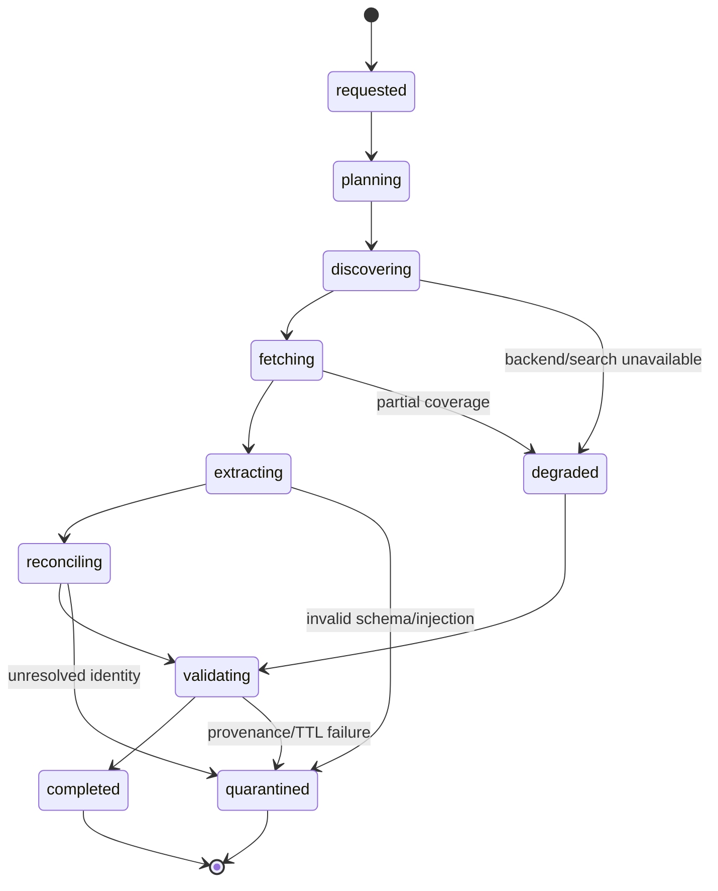

# Coordinador de investigación y noticias

## Decisión ejecutiva propuesta

MOVA conserva una **máquina de estados determinista** como autoridad de la temporada y
añade una **pipeline de investigación acotada** para descubrir, extraer, contrastar y
resumir información no estructurada. La pipeline no decide el equipo, no escribe en FPL y
no controla el calendario.

La estrategia de proveedores es híbrida:

- collectors deterministas para API FPL, fixtures, estado privado y fuentes estructuradas;
- OpenRouter como inferencia estructurada habitual para extracción, clasificación y crítica
  con costos y modelos configurables, sin construir otro agent loop;
- `codex exec --search` como job agéntico autocontenido para discovery profundo,
  contradicciones y revisiones cercanas al deadline;
- HTTP directo como extractor preferido, Firecrawl como adapter opcional cuando una página
  no pueda normalizarse de forma fiable y browser solo como excepción dinámica/autenticada.

La autoridad final sigue siendo:

`datos validados → policy determinista → mova_fpl.engine.runner.decide() → gates → executor`.

## Objetivos

1. Investigar noticias de forma dirigida por plantilla, candidatos, clubs y horizonte.
2. Convertir texto abierto en señales versionadas, citadas, temporales y reconciliables.
3. Poder cambiar el backend de una tarea sin cambiar el dominio FPL.
4. Conservar inputs, outputs, hashes, uso y fallos suficientes para replay y evaluación.
5. Evitar búsquedas amplias repetidas, gasto no acotado y contaminación por prompt injection.
6. Degradar con seguridad si falla búsqueda, extracción, LLM o autenticación.
7. Medir si las señales realmente mejoran decisiones mediante atribución pareada.

## No objetivos

- dar a un LLM autoridad sobre deadline, transferencias, XI, capitán, chips o browser;
- reemplazar bootstrap, fixtures, estado privado o modelos con resultados de web search;
- construir un agent loop general, planner abierto o memoria conversacional perpetua;
- almacenar artículos completos por defecto;
- auto-promover prompts, modelos, fuentes o reglas;
- instalar Redis, Postgres, una cola distribuida o un stack pesado de observabilidad;
- convertir el wrapper experimental de `/tmp` en producción sin hardening y release.

## Autoridades y fronteras

| Capa | Autoridad | Puede producir | No puede producir |
| --- | --- | --- | --- |
| Orquestador | reloj, fase, idempotencia y gates | `ResearchRequest` | claims deportivos |
| Collector oficial | hechos estructurados | `OfficialFact`, snapshots | interpretación libre |
| Discovery | localizar URLs candidatas | `DiscoveryCandidate` | señal aceptada |
| Fetch/extract | recuperar evidencia | `SourceDocument` | intervención |
| Agent backend | interpretar texto | `SignalCandidate`, crítica, brief | `Decision`, write envelope |
| Signal policy | identidad, TTL, tier, corroboración y límites | `AcceptedSignal` o cuarentena | elegir plantilla |
| Intervention policy | mapear señales aceptadas a contrato acotado | `Intervention` | saltarse el optimizador |
| `mova_fpl` | proyección y optimización | `Decision` | operar browser |
| Executor/verifier | aplicar envelope cerrado y comprobar | evidencia/verificación | improvisar acciones |

El texto descargado de internet se trata siempre como **datos no confiables**, nunca como
instrucciones para el agente.

## Topología

```mermaid
flowchart LR
  tick["tick determinista"] --> context["build research context"]
  context --> inbox[("request package\ninbox")]

  subgraph agent["mova-research · one-shot · sin ops.db"]
    inbox --> plan["plan acotado"]
    plan --> official["official discovery"]
    plan --> web["web discovery"]
    web --> codex["Codex --search"]
    official --> fetch["direct / Firecrawl adapter"]
    codex --> fetch
    fetch --> extract["OpenRouter / Codex extractor"]
    extract --> reconcile["dedupe · identity · conflict · critic"]
    reconcile --> outbox[("result package\noutbox")]
  end

  outbox --> importer["schema + provenance validator"]
  importer --> ops[("ops.db ledger")]
  importer --> artifacts[("research artifacts")]
  ops --> policy["deterministic signal policy"]
  policy --> intervention["Intervention"]
  intervention --> engine["mova_fpl.decide"]
```



## Dos máquinas de estado, una sola autoridad

### Ciclo exterior

La máquina de estados existente por `(season, gw)` conserva deadline, fase, revisión,
ejecución y settlement. El LLM nunca decide qué nodo exterior sigue.

### Research run interior

Cada `ResearchRequest` crea una corrida finita e inmutable:



Estados terminales: `completed`, `degraded`, `quarantined`, `failed`, `cancelled`.
Reintentar crea un nuevo `attempt` bajo el mismo `agent_run_id`; nunca sobrescribe un
output anterior.

### Decisión de framework

La pipeline será Python async explícito sobre el `Harness`, `job_runs`, `job_steps` y
`ops.db` que ya existen. **LangGraph queda fuera de esta iniciativa**: duplicaría máquina de
estados, checkpointer, retries y autoridad sin resolver un problema actual.

Tampoco se reconstruye el agent loop de Codex. `CodexExecBackend` invoca
`codex exec --ephemeral --json --output-schema` como un job finito y consume sus eventos.
`OpenRouterInferenceBackend` hace una llamada estructurada sin autonomía ni tools. Si en el
futuro se requieren conversaciones persistentes o aprobaciones dentro del propio agente,
eso exigirá una ADR nueva; no es una evolución implícita de esta spec.

## Catálogo inicial de tareas

| Task | Backend preferido | Entrada | Salida | Autoridad |
| --- | --- | --- | --- | --- |
| `news_discovery` | Codex search | roster, clubs, queries, cutoff | URLs candidatas | advisory |
| `source_extract` | OpenRouter | excerpt/documento + identities | candidates estructurados | advisory |
| `signal_reconcile` | OpenRouter | candidates + source tiers | conflictos y consenso | advisory |
| `deadline_brief` | Codex | facts + señales + conflictos | brief citado | advisory |
| `decision_critic` | Codex u OpenRouter fuerte | decisión + supuestos + señales | objeciones/checks | advisory |
| `log_diagnosis` | Codex read-only | logs redactados | diagnóstico | operativo, sin write |

No se implementa un `fpl_manager` end-to-end.

## Integración mínima de backends

```python
class ResearchBackend(Protocol):
    def run(self, request: ResearchRequest) -> ResearchResult: ...

class CodexExecBackend: ...          # agent loop ya provisto por Codex
class OpenRouterInferenceBackend: ... # structured inference stateless
```

El coordinador de MOVA no ofrece tools genéricas al modelo ni permite que este elija el
siguiente estado. Construye un contexto cerrado, llama un backend y valida el resultado.

## Política de selección de backend

1. La tarea declara capacidades requeridas: `web_search`, `structured_output`,
   `long_context`, `reasoning`, `max_latency` y `max_cost`.
2. El router elige desde una policy versionada; el prompt no elige su proveedor.
3. Un fallback solo ocurre si está declarado y siempre crea un intento nuevo.
4. Cambiar de modelo a mitad de una corrida está prohibido.
5. La concordancia entre dos modelos no cuenta como corroboración independiente; cuentan
   las fuentes subyacentes.
6. Codex se reserva para trabajo de alto valor. No se ejecuta en cada tick.

Policy inicial propuesta:

| Fase | Trabajo rutinario | Codex search | Límite recomendado |
| --- | --- | --- | --- |
| `baseline` | fuentes oficiales + diff | no | cero si no hay cambio |
| T-48h/T-24h | extracción OpenRouter | una investigación amplia | 1 corrida |
| T-6h | refresco dirigido | solo conflicto/materialidad | 0–1 corrida |
| T-90m | extracción final | deadline brief | 1 corrida |
| T-60m a T-15m | solo delta crítico | emergencia aprobada por policy | máximo 1 |
| settlement | atribución y resumen | no por defecto | cero |

El POC del 2026-08-22 consumió 183.658 tokens de entrada —140.032 cacheados— y cinco
búsquedas para una sola consulta. Por eso cada corrida Codex MUST tener timeout, contador
de búsquedas observado, cuota por GW y circuit breaker de uso.

## Planificación de búsqueda

Las consultas se generan desde un universo acotado:

- 15 jugadores de la plantilla;
- candidatos materiales del optimizador, con límite configurable;
- clubs de esos jugadores;
- jugadores con señal vigente o conflicto abierto;
- términos controlados: injury, availability, suspension, press conference, predicted
  lineup, minutes, role, set pieces y registration.

La búsqueda league-wide solo ocurre en la corrida amplia de T-24h. Las siguientes corridas
son delta-driven: no repiten una fuente si `etag`, `last-modified` o hash no cambió y la
señal continúa fresca.

## Jerarquía de adquisición

| Orden | Adapter | Uso | Persistencia por defecto |
| ---: | --- | --- | --- |
| 1 | collector/API oficial | hechos estructurados | snapshot inmutable |
| 2 | HTTP/RSS directo | páginas estáticas y feeds | metadata + excerpt + hash |
| 3 | Firecrawl `scrape` | extracción difícil de URL conocida | metadata + extract acotado |
| 4 | Codex `--search` | discovery/síntesis profunda | queries, URLs, resultado JSON |
| 5 | browser read-only | JS/auth excepcionales | evidencia redactada |

Firecrawl `search` MAY ser un backend alterno de discovery. Firecrawl `agent` queda fuera
del MVP porque duplica el planner agéntico, consume créditos variables y reduce control.
La credencial Firecrawl del VPS todavía no está verificada y su ausencia debe degradar al
adapter directo, no tumbar el ciclo.

## Contratos de entrada

### `ResearchRequest` v1

Artefacto canónico que el engine deja en el inbox:

```json
{
  "schema_version": "mova-research-request-v1",
  "request_id": "rr_...",
  "agent_run_id": "ar_...",
  "correlation_id": "corr_...",
  "cycle": {
    "season": "2026-27",
    "gw": 2,
    "phase": "refresh",
    "deadline_at": "2026-08-28T17:30:00Z",
    "cutoff_at": "...Z"
  },
  "task": {
    "name": "news_discovery",
    "version": "1.0.0",
    "prompt_sha256": "...",
    "output_schema_sha256": "..."
  },
  "subjects": {
    "owned_elements": [1],
    "candidate_elements": [2],
    "clubs": [3]
  },
  "official_facts": [],
  "previous_signal_refs": [],
  "source_policy_version": "fpl-research-sources-v1",
  "budgets": {
    "timeout_seconds": 240,
    "max_queries": 5,
    "max_documents": 30,
    "max_output_tokens": 4000
  },
  "input_manifest_sha256": "..."
}
```

Reglas:

- no incluye cookies, tokens, profile paths, browser storage ni secretos;
- los hechos oficiales se diferencian explícitamente de claims web;
- nombres siempre viajan junto con `element`, club y temporada para resolver identidad;
- el request es read-only y queda sellado antes de iniciar el backend.

## Contratos intermedios

### `DiscoveryCandidate`

Campos mínimos: `url`, `canonical_url`, `title`, `publisher`, `query_id`,
`discovered_by`, `rank`, `published_at_hint`, `subject_hints`, `source_policy_match` y
`discovered_at`.

### `SourceDocument`

Campos mínimos: `document_id`, URL canónica, método de fetch, HTTP status, content type,
idioma, publisher, `retrieved_at`, `published_at`, `payload_sha256`, `normalized_sha256`,
extractor/version, `storage_mode`, excerpt/evidence refs, tier propuesto, freshness,
robots/terms disposition y `prompt_injection_status`.

`storage_mode` puede ser:

- `metadata_only`: URL, fechas, headers y hashes;
- `excerpt`: metadata más fragmentos mínimos necesarios para evidencia;
- `full_licensed`: contenido completo solo cuando política/licencia lo autorice.

## Contratos de salida

### `ResearchSignal` v2

La tabla actual soporta una sola URL por señal y no representa bien corroboración. El
contrato nuevo separa señal de fuentes:

```json
{
  "schema_version": "mova-research-signal-v2",
  "signal_id": "sig_...",
  "cycle_id": "cycle_...",
  "subject": {
    "type": "player",
    "element": 123,
    "canonical_name": "Player",
    "club_id": 10
  },
  "claim_type": "availability",
  "claim": "...",
  "claim_status": "reported",
  "direction": "negative",
  "effective_from": "...Z",
  "expires_at": "...Z",
  "confidence": 0.78,
  "source_refs": ["doc_1", "doc_2"],
  "corroboration": {
    "independent_sources": 2,
    "highest_tier": "T1",
    "conflict_group_id": null
  },
  "effect_hint": {
    "metric": "minutes_probability",
    "direction": "decrease",
    "magnitude": "material"
  },
  "evidence_sha256": "...",
  "generated_by": "agent_run_id",
  "validation_status": "candidate"
}
```

`claim_type` inicial: `availability`, `injury`, `suspension`, `predicted_lineup`,
`minutes_role`, `set_piece_role`, `registration`, `transfer`, `discipline`,
`manager_quote`, `price_change` y `schedule_change`.

`claim_status`: `confirmed`, `reported`, `predicted`, `inferred`, `retracted`.

El LLM solo puede emitir `candidate`. La policy determinista cambia a `accepted`,
`rejected`, `expired` o `quarantined`.

### `ResearchResult` v1

Envelope final de la corrida:

```json
{
  "schema_version": "mova-research-result-v1",
  "agent_run_id": "ar_...",
  "request_sha256": "...",
  "backend": "codex_cli",
  "provider": "openai_chatgpt",
  "model": "recorded-at-runtime",
  "task_version": "1.0.0",
  "prompt_sha256": "...",
  "output_schema_sha256": "...",
  "status": "completed",
  "started_at": "...Z",
  "finished_at": "...Z",
  "usage": {
    "input_tokens": 0,
    "cached_input_tokens": 0,
    "output_tokens": 0,
    "search_calls": 0,
    "estimated_cost": null,
    "currency": null
  },
  "documents": [],
  "signals": [],
  "conflicts": [],
  "limitations": [],
  "output_sha256": "..."
}
```

La salida no conserva chain-of-thought. Se guardan eventos de tool/estado, resultado final,
uso y errores redactados.

## De señal a intervención

```text
SignalCandidate
  → schema validation
  → player identity resolution
  → source policy/tier
  → freshness/TTL
  → dedupe/corroboration/conflict
  → AcceptedSignal
  → deterministic effect mapping
  → Intervention candidate
  → validate() + paired decision with/without
  → shadow attribution
```

Un `effect_hint` no es un multiplicador. La policy decide si corresponde ajustar minutos,
vetar temporalmente o no actuar.

### Gap del contrato actual

`Intervention.xp_multiplier` se propaga hoy a todo el horizonte. No puede expresar de forma
segura “duda solo para GW2” o una recuperación progresiva. Antes de que noticias afecten
producción se requiere `Intervention v2`, preferiblemente con overrides por GW sobre
probabilidad de minutos, no con un multiplicador global de xP. Hasta entonces toda
integración noticias → intervención permanece en shadow.

## Persistencia

### Layout propuesto

```text
/var/lib/mova-fpl/
├── agent/
│   ├── inbox/                      # requests sellados; read-only para agent
│   ├── processing/                 # claim atómico por rename
│   ├── outbox/                     # outputs sellados; read-only para importer
│   ├── quarantine/                 # schema/provenance/injection failures
│   └── codex-home/                 # 0700; auth sensible; fuera de backup general
└── artifacts/research/
    └── 2026-27/gw02/ar_<id>/
        ├── request.json
        ├── discovery.json
        ├── source-manifest.json
        ├── result.json
        ├── validation.json
        ├── events.jsonl
        └── brief.md
```

Los documentos grandes se deduplican en `artifacts/sources/sha256/<prefix>/<hash>` solo si
su policy permite almacenamiento. `ops.db` guarda metadata consultable y paths/hashes; no
guarda páginas, prompts completos, eventos JSONL ni outputs extensos.

### Tablas nuevas o migradas en `ops.db`

| Tabla | Propósito | Invariante principal |
| --- | --- | --- |
| `agent_runs` | ejecución de un task/backend/model | run+attempt unique; request/output hashes |
| `research_queries` | queries y discovery | run+query hash unique; sin texto secreto |
| `research_documents` | documentos recuperados | canonical URL+normalized hash; policy/TTL |
| `research_signals` v2 | claim independiente de fuente | identidad, vigencia y estado validados |
| `research_signal_sources` | evidencia many-to-many | signal+document unique |
| `research_conflicts` | versiones incompatibles | grupo, severidad, resolución y actor |

`job_runs` sigue siendo el ledger del trabajo exterior y referencia el `agent_run_id` en
`metrics_json`/steps. No se crea otra base. El container agéntico no abre `ops.db`: el
engine importa el result package después de validar schema, hashes y request linkage.

## Ejecución en el VPS

Tercera imagen propuesta: `mova-research`.

- proceso one-shot y usuario sin privilegios, sin daemon agéntico residente;
- filesystem root read-only;
- lee un request package y escribe un único result package;
- no monta `ops.db`, canonical DB, browser profile, Docker socket, SSH keys ni secretos FPL;
- monta solo la credencial del backend seleccionado;
- límites de CPU, RAM, PIDs, timeout y una corrida concurrente;
- egress restringido cuando el backend lo permita.

El unit de tick puede ejecutar secuencialmente:

1. `mova-worker tick` crea requests pendientes;
2. `mova-research drain --max-jobs=1` procesa un request;
3. `mova-worker import-agent-results` valida/importa outputs.

Una caída entre pasos es recuperable porque inbox/outbox usan rename atómico y hashes. Un
timer de reconciliación recoge paquetes abandonados; no se monta el socket Docker dentro de
ningún contenedor.

## Credenciales

| Credencial | Ubicación formal | Backup | Consumidor |
| --- | --- | --- | --- |
| OpenRouter API key | `/etc/mova-fpl/secrets/openrouter_api_key` 0600 | secret store autorizado | `mova-research` |
| Codex `auth.json` | `/var/lib/mova-fpl/agent/codex-home/auth.json` 0600 | excluido por defecto | solo task Codex |
| Firecrawl key | `/etc/mova-fpl/secrets/firecrawl_api_key` 0600 | opcional | adapter Firecrawl |
| perfil FPL | `/var/lib/mova-fpl/browser-profile` 0700 | excluido | solo browser |

Codex auth y perfil FPL nunca se montan juntos. Un fallo de refresh de Codex crea
`blocked_auth_agent`, no solicita credenciales automáticamente y no afecta collector,
modelos ni verificación del equipo.

## Seguridad

Controles MUST:

1. allowlist de schemas y claves; rechazo de campos desconocidos;
2. URL canonicalization, bloqueo de localhost/red privada/metadata endpoints y redirects;
3. límite de tamaño, MIME, tiempo, redirects y profundidad de fetch;
4. retrieved content delimitado como untrusted data;
5. detector de prompt injection con cuarentena para instrucciones materiales;
6. ninguna herramienta de shell/browser disponible al extractor OpenRouter;
7. Codex en sandbox read-only, `--ephemeral`, sin rules/config del usuario y output schema;
8. ningún secreto, token, cookie o path sensible en request, prompt, events o result;
9. logs y artefactos con `0600`, directorios `0700` y hashes antes de importar;
10. no seguir acciones sugeridas por una página, aunque diga ser oficial.

## Idempotencia

Clave de una corrida:

```text
season + gw + task_name + task_version + input_manifest_sha256
+ source_policy_version + provider_policy_version
```

El importer acepta un result solo si:

- existe el request exacto;
- hashes y schema versions coinciden;
- `agent_run_id`, cycle y cutoff coinciden;
- el output no fue importado antes;
- timestamps no cruzan cutoff/deadline de forma inválida;
- todas las `source_refs` resuelven a documentos conocidos;
- toda identidad de jugador se resolvió inequívocamente.

## Degradación y fallos

| Fallo | Respuesta |
| --- | --- |
| Codex auth expirada | usar fallback declarado o continuar sin deep search; incidente P2/P1 por fase |
| límite de suscripción/uso | circuit breaker hasta próxima ventana; no reintento rápido |
| OpenRouter timeout/429 | backoff acotado y un fallback versionado |
| Firecrawl ausente | HTTP directo; browser read-only solo si source policy lo permite |
| JSON inválido | un repair determinista/LLM máximo; después cuarentena |
| URL sin evidencia recuperable | candidate rechazado, no señal |
| identidad ambigua | cuarentena, nunca fuzzy match silencioso |
| conflicto oficial/material | ambas señales persisten; bloqueo del efecto de alto impacto |
| noticias obligatorias stale | no write; se permite decisión shadow degradada |
| agent runner caído | collectors/modelos siguen; dashboard declara `research_degraded` |

Nunca se usa una señal expirada anterior para habilitar un write. Puede conservarse como
contexto histórico claramente marcado.

## Observabilidad

### Logs y ledger

Campos adicionales:

`agent_run_id`, `task_name`, `task_version`, `backend`, `provider`, `model`, `attempt`,
`request_sha256`, `prompt_sha256`, `schema_sha256`, `query_count`, `document_count`,
`signal_count`, `conflict_count`, `quarantine_count`, `input_tokens`,
`cached_input_tokens`, `output_tokens`, `estimated_cost`, `fallback_reason`.

No usar URL, player, run ID, model exacto ni hashes como labels Prometheus.

### Métricas

| Métrica | Uso |
| --- | --- |
| `mova_agent_runs_total{backend,task,status}` | salud por adapter |
| `mova_agent_duration_seconds{backend,task}` | latencia y timeout |
| `mova_agent_tokens_total{backend,direction}` | consumo |
| `mova_agent_search_calls_total{backend}` | controlar búsqueda |
| `mova_research_documents_total{tier,status}` | cobertura/errores |
| `mova_research_signals_total{claim,status}` | volumen útil |
| `mova_research_conflicts_open` | riesgo previo al freeze |
| `mova_research_coverage_ratio` | subjects obligatorios cubiertos |
| `mova_research_latest_success_unixtime` | freshness del pipeline |
| `mova_research_invalid_output_total{backend}` | drift de prompt/modelo |
| `mova_research_injection_flags_total{action}` | seguridad |

### SLO propuestos

- 100% de señales aceptadas tienen identidad, TTL y al menos una evidencia resoluble;
- 100% de outputs decisivos validan contra schema y request hash;
- cero señales candidatas escriben directamente una `Intervention` productiva;
- investigación obligatoria final completa antes de T-70m para freeze T-60m;
- una corrida Codex termina o aborta en ≤240s;
- cero secretos en prompts, outputs, logs y artifacts generales;
- toda intervención con efecto tiene comparación con/sin y settlement posterior.

## Evals y promoción

Dataset gold versionado con casos de:

- lesión confirmada, duda y regreso progresivo;
- suspensión y apelación/retractación;
- predicted lineup presentada erróneamente como confirmación;
- jugadores homónimos o cambio de club;
- fuente vieja republicada cerca del deadline;
- dos fuentes que copian el mismo reporte original;
- rumor viral contradicho por club;
- páginas con instrucciones de prompt injection;
- source outage y contenido dinámico vacío;
- cambio crítico después del cutoff.

Métricas mínimas: precisión/recall por claim, identity resolution, citation validity,
freshness, conflict detection, invalid JSON, costo, latencia y efecto pareado en decisiones.

Promoción:

`fixture tests → recorded web replay → live shadow → paired attribution → approved policy`.

Un backend puede aprobarse para `source_extract` y seguir prohibido para
`decision_critic`; la promoción es por task+version, no por marca de modelo.

## Hoja de ruta

### AR-0 — Aprobación de contratos

- aprobar esta spec y ADR-009;
- cerrar schemas v1/v2 y source policy;
- decidir límites por GW y retención de excerpts.

### AR-1 — Coordinador determinista offline

- migrations `agent_runs` y research v2;
- inbox/outbox atómico e importer;
- adapters fake y replay sin red;
- fixtures gold, schemas y pruebas de seguridad.

### AR-2 — OpenRouter shadow

- adapter HTTP con modelo configurable;
- extracción/clasificación de documentos ya recuperados;
- uso, costo, timeout, retry y circuit breaker;
- ninguna búsqueda ni intervención productiva.

### AR-3 — Discovery y extracción web

- source registry versionado;
- HTTP/RSS directo;
- Firecrawl opcional y fallback;
- dedupe, canonicalización, TTL, evidence y conflicts.

### AR-4 — Codex specialist

- formalizar el POC en `mova-research` sin root;
- `CODEX_HOME` dedicado y health/auth status;
- tasks `news_discovery`, `deadline_brief`, `decision_critic`;
- cuotas y observabilidad de searches/tokens.

### AR-5 — Policy e intervención shadow

- `Intervention v2` temporal por GW/minutos;
- mapping determinista y sensitivity;
- comparación con/sin y acta;
- al menos tres rehearsals o GWs shadow.

### AR-6 — Readiness operativo

- alertas, dashboard y runbook;
- auth expiry, 429, stale news, injection y reboot drills;
- promoción separada por task/backend.

Nada en AR-0..AR-6 habilita browser writes; eso permanece bajo G4+ y ADR-004.

## Decisiones para conversar

| ID | Recomendación | Estado |
| --- | --- | --- |
| D-AR-01 | outer FSM propio; subflujo agéntico sin autoridad | respaldada por ADR existentes |
| D-AR-02 | OpenRouter rutinario + Codex especialista | propuesta |
| D-AR-03 | `mova-research` one-shot separado, no plataforma compartida prematura | propuesta |
| D-AR-04 | Python async explícito; LangGraph fuera de la iniciativa | decidida |
| D-AR-05 | metadata+excerpt+hash; no artículos completos por defecto | propuesta |
| D-AR-06 | Codex máximo T-24h, T-90m y emergencia | propuesta |
| D-AR-07 | Firecrawl adapter opcional; `agent` fuera del MVP | propuesta |
| D-AR-08 | noticias no afectan producción antes de `Intervention v2` | blocker técnico |

Pendiente después de aprobar arquitectura: seleccionar modelos concretos de OpenRouter con
un benchmark local; verificar credencial Firecrawl en VPS; fijar allowlist inicial de
fuentes; acordar cuota monetaria/tokens por GW y canal de alertas.

## Definition of done del bloque agéntico

1. Los contratos y schemas están versionados y probados offline.
2. Todo run es reproducible desde request, source manifest, versions y hashes.
3. Los backends son intercambiables por policy sin cambiar `mova_fpl`.
4. Una caída de todos los backends deja el sistema en estado seguro y observable.
5. Toda señal aceptada tiene evidencia, tier, identidad, TTL y conflicto resuelto/declarado.
6. No hay secretos ni contenido no autorizado en artifacts/ops/logs.
7. Costos, tokens, searches, latencia y fallos se consultan por GW/task/backend.
8. La atribución pareada demuestra el efecto de cada intervención.
9. Tres rehearsals/GWs shadow cumplen freshness, replay e incident drills.
10. Ningún componente agéntico tiene ruta directa al executor FPL.

## Referencias de implementación

- [OpenAI Docs — non-interactive mode](https://learn.chatgpt.com/docs/non-interactive-mode)
- [OpenAI Docs — Codex App Server](https://learn.chatgpt.com/docs/app-server)
- [OpenAI Docs — authentication](https://learn.chatgpt.com/docs/auth)
- playbook Orbital `.claude/commands/firecrawl.md`
- [OpenAI — Codex as a platform](https://learn.chatgpt.com/blog/codex-as-a-platform)
