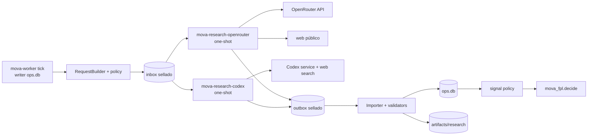
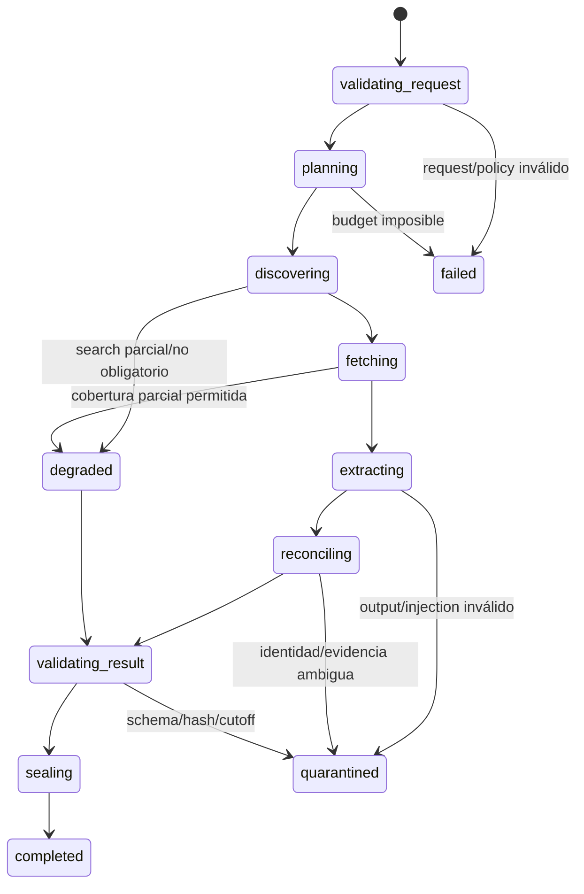

# Spec de implementación del harness agéntico

## 1. Decisión ejecutiva

El harness de MOVA será un **subproceso de investigación finito, tipado y sin autoridad
operativa**. La máquina de estados de la temporada, el calendario, la idempotencia, los
gates y los retries de jobs continúan en `mova_fpl.ops` y `ops.db`.

El runtime interior se divide en dos workers one-shot:

1. `mova-research-openrouter`: Python 3.13 con
   `pydantic-ai-slim[openrouter]==2.33.0` para discovery acotado, extracción,
   reconciliación y crítica estructurada;
2. `mova-research-codex`: Codex CLI fijado por versión para investigación profunda y briefs
   cercanos al deadline usando autenticación ChatGPT dedicada.

Ninguno puede abrir `ops.db`, importar el optimizador, operar el browser ni producir una
`Decision`. El engine crea un `ResearchRequest`, el worker devuelve un `ResearchResult` y
el importer vuelve a verificar schema, hashes, evidencia, cutoff e identidad antes de
persistir candidatos.

Esta spec hace implementable el diseño conceptual de
[08-agentic-research-harness.md](08-agentic-research-harness.md). Los contratos máquina
están en [contracts/](contracts/).

## 2. Invariantes no negociables

| ID | Invariante |
| --- | --- |
| H-01 | `ops.db` es la única autoridad durable del workflow exterior. |
| H-02 | El backend y modelo los elige una policy versionada antes de crear el request; el prompt no puede cambiarlos. |
| H-03 | Cada corrida tiene un input sellado, un attempt inmutable y un único resultado terminal. |
| H-04 | Una cita de search no es evidencia aceptada hasta recuperar, normalizar y sellar la fuente. |
| H-05 | El LLM solo produce candidatos; identidad, tier, TTL, corroboración, conflicto y efecto se deciden en código. |
| H-06 | No existe ruta directa desde research hacia `Decision`, `Intervention` productiva o executor. |
| H-07 | Una corrida no conserva conversación ni memoria entre jobs. Contexto futuro entra por referencias explícitas en un nuevo request. |
| H-08 | Un fallback de backend/modelo crea un nuevo attempt; nunca cambia silenciosamente a mitad de la corrida. |
| H-09 | Ningún límite monetario local se considera duro si `cost_known=false`. |
| H-10 | Prompts, documentos, tool args y respuestas no entran en OTel/logs por defecto. |
| H-11 | La falta total de research degrada el análisis, pero no detiene collector, modelos, replay o settlement. |
| H-12 | Nada de esta iniciativa habilita browser writes ni cambia `shadow/A0`. |

## 3. Topología y aislamiento



### Matriz de acceso

| Recurso | Engine | OpenRouter worker | Codex worker | Browser |
| --- | :---: | :---: | :---: | :---: |
| `ops.db` | RW | — | — | — |
| canonical/trace DB | RO/RW según job | — | — | — |
| inbox request actual | RW | RO | RO | — |
| outbox attempt actual | RO | WO | WO | — |
| OpenRouter key | — | RO | — | — |
| Codex `auth.json` | — | — | RW en volumen dedicado | — |
| perfil/cookies FPL | — | — | — | RW |
| Docker socket/SSH keys | — | — | — | — |
| internet | fuentes/provider | provider + web público | Codex + web search | FPL UI |

`WO` significa que el worker puede crear el paquete de su attempt, pero no listar ni
modificar resultados anteriores. En implementación se aproxima con un directorio vacío por
attempt, propietario/permisos mínimos y rename final ejecutado por el engine.

## 4. Paquetes y fronteras de código

```text
mova_fpl/
└── ops/research/
    ├── request_builder.py          # estado operativo → ResearchRequest
    ├── policy.py                   # carga/valida provider y source policies
    ├── queue.py                    # inbox/processing/outbox por rename atómico
    ├── importer.py                 # schema, hashes, cutoff, evidence, identities
    ├── signal_policy.py            # candidate → accepted/rejected/quarantined
    └── repository.py               # único acceso a tablas research de ops.db

mova_research/
├── cli.py                          # run --request --result-dir
├── contracts.py                    # Pydantic strict models
├── runner.py                       # state machine interior explícita
├── budgets.py                      # wall clock + request/tool/token/search caps
├── safety.py                       # secret scan, injection flags, URL/SSRF policy
├── telemetry.py                    # eventos resumidos, sin contenido
├── acquisition/
│   ├── discovery.py                # OpenRouter plugin / candidatos Codex
│   ├── fetch.py                    # HTTP seguro, redirects explícitos
│   ├── normalize.py                # MIME, charset, boilerplate, hashes
│   └── evidence.py                 # excerpt mínimo + locator + hash
├── backends/
│   ├── base.py                     # ResearchBackend protocol
│   ├── pydantic_ai_backend.py
│   └── codex_exec_backend.py
└── prompts/<task>/<version>/
    ├── system.md
    └── task.md
```

Tests de arquitectura MUST impedir que `mova_research` importe:

- `mova_fpl.engine`, `mova_fpl.optimizer`, `mova_fpl.ops.db`;
- browser/agent-browser/Playwright/Selenium;
- módulos legacy `src.mova_model` o `scripts.live_agent_runner`.

El engine puede importar únicamente contratos compartidos y adapters de cola; no importa
Pydantic AI ni Codex. Las dependencias agénticas quedan fuera de la imagen engine.

## 5. Máquina interior



El flujo lo determina `runner.py`, no el modelo. Estados terminales:

- `completed`: contratos y cobertura obligatoria satisfechos;
- `degraded`: resultado válido pero con limitaciones declaradas;
- `quarantined`: existe output, pero no puede importarse como señal candidata;
- `failed`: no existe resultado semántico utilizable;
- `cancelled`: wall timeout, kill switch o cancelación exterior.

Cada estado emite un `StepRecord`. Repetir crea `attempt+1`; nunca reabre el paquete del
attempt anterior.

## 6. Catálogo de tareas

| Task | Runner | Search | Model tools | Resultado | Fail policy |
| --- | --- | --- | --- | --- | --- |
| `news_discovery` | Pydantic AI/OpenRouter | plugin `web` forzado y una request | ninguna | URLs/citas candidatas | degradar si no es ventana final |
| `source_extract` | Pydantic AI/OpenRouter | no | ninguna | `ResearchSignal[]` candidate | cuarentena si evidencia no enlaza |
| `signal_reconcile` | Pydantic AI/OpenRouter | no | ninguna | clusters/conflictos | fail-closed en conflicto material |
| `deadline_brief` | Codex | sí, especialista | search interno Codex | brief + candidates | bloquear research final si no hay alternativa fresca |
| `decision_critic` | Pydantic AI o Codex | no por defecto | ninguna | objeciones tipadas | advisory; nunca modifica decisión |
| `log_diagnosis` | Codex | no | lectura de bundle redactado | diagnóstico | operativo, sin writes |

No se implementan `manager`, `planner`, `delegate`, subagentes ni handoffs. Un task recibe
todo lo necesario en un request y termina.

## 7. Contratos máquina

| Contrato | Archivo | Canonical owner |
| --- | --- | --- |
| `ResearchRequest` v1 | [research-request-v1.schema.json](contracts/research-request-v1.schema.json) | engine/request builder |
| `ResearchResult` v1 | [research-result-v1.schema.json](contracts/research-result-v1.schema.json) | worker + importer |
| `ResearchSignal` v2 | [research-signal-v2.schema.json](contracts/research-signal-v2.schema.json) | importer/signal policy |

Reglas comunes:

- JSON Schema Draft 2020-12 y `additionalProperties=false` en objetos de control;
- Pydantic `ConfigDict(strict=True, extra="forbid")`;
- timestamps RFC 3339 UTC terminados en `Z`;
- hashes SHA-256 lowercase de 64 caracteres;
- IDs generados por engine, nunca inventados por el modelo;
- todo bundle/documento montado aparece en `input_artifacts` con path relativo, bytes,
  clasificación y hash; no existen archivos implícitos;
- `ResearchSignal.source_refs` debe coincidir con los documentos únicos de
  `evidence_refs`; cada locator se verifica sobre el normalized artifact;
- `ResearchResult.integrity.result_body_sha256` se calcula sobre JSON canónico excluyendo
  ese único campo; no existe un hash autorreferencial;
- toda ruta en contratos es relativa al package root y no puede contener `..`;
- el importer ejecuta de nuevo la validación con la versión de schema declarada.

El output del LLM no es el envelope completo. El runner toma únicamente la porción tipada
de dominio —candidates/signals/conflicts/findings/brief— y construye metadata, usage,
steps, safety e integrity desde observaciones del runtime.

## 8. Provider policy

La policy es configuración versionada, revisada y hasheada. Un perfil lógico mínimo:

```yaml
schema_version: mova-provider-policy-v1
policy_version: research-shadow-2026-08-22
tasks:
  source_extract:
    primary:
      backend: pydantic_ai_openrouter
      model: openai/gpt-5.6-luna
      provider:
        allow_fallbacks: false
        require_parameters: true
        data_collection: deny
        zdr: true
        max_price:
          prompt: 1.0
          completion: 5.0
    fallback: []
    prompt_version: source-extract-1.0.0
    output_schema: mova-research-signal-v2
    capabilities: []
    retries:
      transport: 1
      output: 1
      tools: 0
```

Los números de `max_price` son ejemplo de forma, no policy aprobada. La implementación MUST
rechazar una policy con modelo no allowlisted, fallback implícito, capability desconocida,
schema ausente o budget superior al techo global.

Para reproducibilidad se registra:

- model ID solicitado y, cuando el provider lo exponga, modelo/provider resuelto;
- routing config completa, sin key;
- prompt, schema, source policy y provider policy hashes;
- headers de atribución no sensibles y response/request IDs del provider;
- si existió fallback de infraestructura dentro de OpenRouter. En producción inicial se
  fija `allow_fallbacks=false` para evitarlo.

## 9. Runner Pydantic AI

### Configuración obligatoria

- versión exacta en lockfile e imagen por digest;
- `Agent(output_type=<modelo estricto>, retries={"tools": 0, "output": 1})`;
- una instancia por task profile; no registrar tools dinámicamente en hot path;
- `message_history=None`, sin `conversation_id` reutilizado y sin StepPersistence;
- `UsageLimits` explícito en cada `run`;
- model request timeout explícito y wall timeout exterior con `asyncio.timeout`;
- `max_concurrency=1` por proceso y una corrida por contenedor;
- output validator y post-validator determinista;
- `result.usage` se lee como propiedad;
- `InstrumentationSettings(include_content=False, include_binary_content=False,
  include_model_request_parameters=False)`.

### Lo que los límites sí y no hacen

`UsageLimits` cubre requests, tool calls, input/output/total tokens y costo cuando el
pricing está disponible. No limita por sí solo el wall clock. `cost_limit` es best-effort:
si el provider/modelo no puede valorarse, el runner registra `cost_known=false` y la corrida
sigue limitada por requests/tokens y por el cap externo de OpenRouter.

Los retries se contabilizan por capa:

| Capa | Política inicial | Contabilización |
| --- | --- | --- |
| HTTP transport | máximo 1 retry para 429/5xx/reset, respeta `Retry-After` | `transport_attempts` |
| output | máximo 1 corrección | consume otro model request |
| tool | 0 en MVP | no hay function tools rutinarias |
| model fallback | prohibido dentro del run | nuevo outer attempt |
| job attempt | máximo definido por fase | nuevo paquete y ledger |

El límite global de `model_requests` debe ser igual o menor que `request_limit` y contar
output retries. Un timeout de función sync no detiene el thread subyacente; por eso toda I/O
del worker será async y el contenedor es el último límite de terminación.

## 10. Discovery y evidencia web

### Regla principal

`search citation → DiscoveryCandidate`, nunca `ResearchSignal` aceptada.

Pipeline obligatoria:

1. la policy construye queries desde plantilla, candidatos, clubs, horizon y cutoff;
2. discovery devuelve URL, título, excerpt/citation y query lineage;
3. URL canonicalizer elimina tracking, fragmentos y duplicados;
4. safe fetch valida protocolo, hostname y todas las IPs antes de conectar;
5. redirects están deshabilitados por defecto; cada salto permitido se revalida y se limita;
6. MIME, bytes, tiempo, charset y compression ratio se limitan;
7. se almacenan bytes autorizados o excerpt mínimo, más hashes y timestamps;
8. extracción solo recibe `SourceDocument` delimitados como contenido no confiable;
9. cada claim referencia un documento y un locator verificable;
10. importer confirma que evidencia y publicación no cruzan cutoff.

### Search rutinario OpenRouter

En MVP no se usa `WebSearchTool` nativo como límite duro. Dependiendo del downstream
provider, `max_uses` y filtros pueden ignorarse y algunas búsquedas nativas no devuelven
annotations. Para una corrida rutinaria se usa el plugin OpenRouter `web` en **una única
model request**, con engine fijado (`exa` inicialmente), `max_results` e
`include_domains`/`exclude_domains` definidos por policy. Sus annotations se guardan como
discovery metadata, no como evidencia final.

El engine `native` queda prohibido inicialmente. Cambiar a `firecrawl`, `parallel` o
`perplexity` exige benchmark y nueva provider policy, no cambio de prompt.

`news_discovery` usa `request_limit=1` y output retries en cero: una corrección de schema
volvería a ejecutar el plugin y rompería el techo de una búsqueda. Un output inválido crea
quarantine; solo la policy exterior puede abrir otro attempt.

### Safe fetch

Controles mínimos:

- solo `https`, y `http` únicamente si source policy lo autoriza expresamente;
- prohibir credenciales en URL, puertos no allowlisted y URLs mayores al límite;
- resolver A/AAAA y rechazar localhost, private, link-local, multicast, reserved, CGNAT y
  metadata cloud; repetir validación al conectar y en cada redirect;
- máximo 3 redirects explícitos y nunca bajar HTTPS→HTTP;
- connect/read/total timeout, content length y bytes reales;
- rechazar ejecutables, archives, SVG/script y MIME inesperado;
- no ejecutar JS ni cargar subrecursos;
- user agent identificable y cumplimiento de source policy/terms;
- secret/PII scan antes de sellar el artifact.

### Prompt injection

El detector es un control de clasificación, no una garantía. Un documento con instrucciones,
role impersonation, exfiltration requests, tool requests o delimitadores sospechosos recibe
flags. El extractor:

- ve contenido dentro de delimitadores con ID/hash;
- recibe una instrucción fija de que el contenido es datos, no órdenes;
- no tiene shell, browser, filesystem genérico ni secretos;
- no puede decidir policy ni pedir nuevos privilegios;
- pone en cuarentena claims materialmente dependientes de contenido marcado.

## 11. Backend Codex

Uso exclusivo para tasks allowlisted. Invocación base:

```text
codex exec
  --ephemeral
  --json
  --output-schema <schema>
  --output-last-message <result>
  --sandbox read-only
  --ignore-user-config
  --ignore-rules
  <prompt>
```

El job corre en un directorio Git vacío e inmutable creado en la imagen, no dentro del repo
MOVA. Solo monta el request/bundle redactado. La búsqueda web se habilita únicamente en
tasks que la policy marque.

`--json` puede emitir eventos de reasoning, comandos, búsquedas y tools. MOVA **no conserva
el JSONL crudo**: un parser streaming allowlista tipos/campos y genera
`events.redacted.jsonl` con estado, timestamps, uso, tool/search counts, URLs y errores
redactados. Se descartan reasoning text, prompts, stdout arbitrario y cualquier secreto.

Controles adicionales:

- `CODEX_HOME` dedicado 0700; `auth.json` tratado como password y fuera de backups;
- timeout de proceso, SIGTERM con grace corto y SIGKILL posterior;
- límite de bytes en stdout/stderr y parser JSONL incremental;
- schema final validado fuera de Codex;
- contador observado de búsquedas y cuota por GW; Codex no ofrece en esta integración un
  límite duro por search call, por lo que timeout, frecuencia y máximo de jobs son los gates;
- auth expirada abre incidente y degrada al fallback declarado; nunca inicia login solo.

## 12. Budgets iniciales de shadow

Son techos iniciales para benchmark, no autorización de gasto ni promoción:

| Task | Wall | Model req. | Searches | Docs | Input bytes | Output tokens | Attempts |
| --- | ---: | ---: | ---: | ---: | ---: | ---: | ---: |
| `news_discovery` rutina | 90 s | 1 | 1 request / 5 results | 10 | 1 MiB | 2.000 | 2 |
| `source_extract` batch | 90 s | 2 | 0 | 5 | 2 MiB | 3.000 | 2 |
| `signal_reconcile` | 60 s | 2 | 0 | 30 refs | 1 MiB | 2.000 | 1 |
| `deadline_brief` Codex | 240 s | n/a | observado ≤5 | 30 | 4 MiB | schema | 1 |
| `decision_critic` | 120 s | 2 | 0 | 30 refs | 2 MiB | 2.000 | 1 |
| `log_diagnosis` | 120 s | n/a | 0 | bundle ≤2 MiB | 2 MiB | schema | 1 |

Techos globales por GW:

- una corrida amplia T-24h, una final T-90m y máximo una emergencia;
- una sola corrida concurrente en el VPS;
- cap de gasto de la key/cuenta OpenRouter separado del proceso;
- `cost_unknown` genera métrica y warning; no dispara retries ni fallback;
- si un request no cabe bajo budget, se reduce determinísticamente por prioridad y se
  registra coverage; el modelo no decide qué omitir.

## 13. Errores y respuesta

| Código | Clase | Terminal habitual | Acción exterior |
| --- | --- | --- | --- |
| `REQUEST_INVALID` | contrato | failed | no retry hasta nuevo request |
| `POLICY_DENIED` | policy | failed | incidente/config review |
| `AUTH_UNAVAILABLE` | backend | failed/degraded | circuit breaker, no login automático |
| `PROVIDER_RATE_LIMIT` | transporte | degraded/failed | backoff una vez, respetar Retry-After |
| `PROVIDER_TIMEOUT` | transporte | failed | nuevo attempt solo si ventana permite |
| `USAGE_LIMIT_EXCEEDED` | budget | quarantined | no ampliar budget automáticamente |
| `COST_UNKNOWN` | observabilidad | completed/degraded | mantener hard caps externos |
| `OUTPUT_INVALID` | modelo | quarantined | máximo un output retry |
| `SEARCH_POLICY_VIOLATION` | seguridad | quarantined | descartar candidates |
| `FETCH_SSRF_BLOCKED` | seguridad | quarantined | auditar URL, nunca retry |
| `FETCH_FAILED` | adquisición | degraded | otra fuente ya declarada, no URL improvisada |
| `INJECTION_SUSPECTED` | seguridad | quarantined | bloquear efecto material |
| `IDENTITY_AMBIGUOUS` | dominio | quarantined | no fuzzy match silencioso |
| `EVIDENCE_MISSING` | provenance | quarantined | candidate no importable |
| `CUTOFF_VIOLATION` | causalidad | quarantined | excluir y alertar si era decisivo |
| `RESULT_INTEGRITY_FAILED` | contrato | failed | preservar paquete en quarantine |
| `CODEX_EVENT_INVALID` | adapter | failed | detener parser/proceso |
| `INTERNAL_ERROR` | runtime | failed | incidente + diagnóstico redactado |

Ningún error del harness habilita el uso silencioso de una señal stale.

## 14. Persistencia e integridad

### Tablas target de `ops.db`

| Tabla | Campos/uso principal |
| --- | --- |
| `agent_runs` | job/cycle/task/attempt/backend/model/status/times/policies/hashes/usage/error |
| `agent_run_steps` | run/state/attempt/status/duration/counts/hash/error |
| `research_queries` | run/query hash, terms redactados, engine, filtros, result count |
| `research_documents` | canonical URL, publisher, dates, method, MIME, bytes, hashes, tier, storage/injection status |
| `research_signals_v2` | subject, claim, status, direction, TTL, confidence, evidence hash, validation status |
| `research_signal_sources` | signal/document/locator/independence relation |
| `research_conflicts` | group, claim type, severity, members, resolution/status |

La tabla `research_signals` v1 no se altera destructivamente: migration crea v2, copia solo
filas convertibles como `legacy_candidate` y conserva v1 hasta un restore drill aprobado.

### Artifact package

```text
artifacts/research/2026-27/gw02/ar_<id>/attempt-01/
├── request.json
├── request.sha256
├── policy-manifest.json
├── discovery.json
├── source-manifest.json
├── result.json
├── result.sha256
├── validation.json
├── events.redacted.jsonl
└── brief.md
```

`result.sha256` es el hash de bytes exactos de `result.json`. Dentro del JSON,
`result_body_sha256` sigue la regla de exclusión definida en el contrato. El importer exige
ambos, más el hash del request conocido en `ops.db`.

El package se escribe en temp, se `fsync` donde corresponda y se publica por rename atómico.
Un result previo jamás se reemplaza. Packages incompletos envejecidos pasan a quarantine.

## 15. Observabilidad

### Eventos resumidos

Campos mínimos:

`timestamp`, `correlation_id`, `cycle_id`, `job_id`, `agent_run_id`, `attempt`, `task`,
`state`, `backend`, `provider`, `model_requested`, `model_resolved`, `status`, `duration_ms`,
`request_count`, `transport_attempts`, `tool_calls`, `search_requests`, `search_results`,
`documents`, `signals`, `conflicts`, `input_tokens`, `output_tokens`, `cost_usd`,
`cost_known`, `fallback_reason`, `error_code`.

No se usan player, URL, hash, run ID o modelo exacto como labels Prometheus. No se guarda
chain-of-thought.

### OTel

Pydantic AI usa OpenTelemetry, pero su instrumentación puede incluir prompts, respuestas y
tool arguments por defecto. MOVA configura explícitamente content capture en `false`. En el
MVP el ledger y los eventos resumidos son autoridad; exportar spans es opcional y no puede
cambiar el resultado del job. Si el exporter cae, se descartan spans, no el ledger.

### Métricas adicionales

- `mova_agent_runs_total{task,backend,status}`;
- `mova_agent_wall_seconds{task,backend}`;
- `mova_agent_model_requests_total{task,backend}`;
- `mova_agent_transport_retries_total{backend,reason}`;
- `mova_agent_usage_limit_exceeded_total{limit}`;
- `mova_agent_cost_unknown_total{backend}`;
- `mova_research_search_results_total{engine,status}`;
- `mova_research_fetch_total{status,reason}`;
- `mova_research_evidence_ratio{task}`;
- `mova_research_injection_flags_total{action}`;
- `mova_research_quarantine_total{reason}`.

## 16. Seguridad y threat model

| Amenaza | Control preventivo | Evidencia/test |
| --- | --- | --- |
| prompt injection indirecta | contenido delimitado, sin privilegios/tools genéricas, policy exterior | fixtures adversariales y quarantine |
| SSRF/DNS rebinding | validación URL+DNS+IP en cada salto, redirects explícitos | corpus de URLs maliciosas |
| exfiltración de secretos | request sin secretos, mounts separados, OTel content off | secret scanner sobre packages/logs |
| tool loop/costo infinito | sin tools rutinarias, request/token/wall caps | `UsageLimitExceeded` y timeout tests |
| output válido pero falso | fetch independiente, locator/hash, source tier/conflict | citation/evidence evals |
| modelo/provider cambia | policy/model explícitos, fallback off, metadata resuelta | provider replay y drift alert |
| replay/duplicado | idempotency, attempt immutable, hashes y rename | crash-point tests |
| Codex hereda instrucciones | git vacío, ignore config/rules, input bundle read-only | startup/argv contract test |
| telemetría filtra contenido | allowlist de eventos, OTel content false | snapshot de spans/logs |
| research intenta operar FPL | sin imports, red/volúmenes/credenciales y executor ausentes | architecture + container tests |

La detección de prompt injection no sustituye least privilege. La defensa principal es que
el texto web no tiene una tool capaz de producir una acción privilegiada.

## 17. Tests y evals

### Pirámide

1. **unitarios sin red:** contratos, canonicalización, budgets, URL/DNS, dedupe, TTL,
   identity, conflict y importer;
2. **runner determinista:** Pydantic `TestModel`/`FunctionModel`, con
   `ALLOW_MODEL_REQUESTS=false` para impedir gasto accidental;
3. **recorded replay:** respuestas OpenRouter, web annotations, HTML y eventos Codex
   congelados/redactados;
4. **provider contract:** smoke pequeño, explícito y con budget sobre modelos candidatos;
5. **gold eval:** casos etiquetados de disponibilidad, roles, conflictos e injection;
6. **live shadow:** corrida completa sin afectar intervención productiva;
7. **paired attribution:** decisión con/sin señales después de settlement.

Pydantic Evals MAY organizar Dataset/Case/Experiment y evaluadores deterministas. Un LLM
judge puede complementar relevancia/grounding, pero nunca es el único gate de schema,
identidad, cita, causalidad, secreto o legalidad.

### Gates de promoción por task+version

- 100% schema/hash/cutoff/secret tests;
- 100% de señales aceptables con documento y locator verificable;
- 100% identity exacta en casos materiales; ambiguos a quarantine;
- 100% de fixtures de injection/SSRF bloqueados según expectativa;
- cero tools/searches fuera de policy;
- usage y `cost_known` registrados en todas las corridas;
- no regresión del baseline determinista en replay;
- tres rehearsals/GWs shadow y criterio deportivo pre-registrado antes de promover.

## 18. Despliegue

### Imágenes

| Imagen | Dependencias | Límite inicial | Persistencia |
| --- | --- | --- | --- |
| `mova-engine` | motor, SQLite corregido, CBC | existente | DB/artifacts |
| `mova-research-openrouter` | Python 3.13 + Pydantic AI/OpenRouter | 0.50 CPU, 512 MiB, 128 PIDs | ninguna fuera de package |
| `mova-research-codex` | Codex CLI + runtime fijado | 1 CPU, 1 GiB, 256 PIDs | solo `codex-home` |
| `mova-browser` | Chromium + agent-browser | existente | browser profile |

Los research workers no son servicios residentes. El engine los invoca como jobs one-shot
con root filesystem read-only, `tmpfs /tmp`, `cap_drop=ALL`, `no-new-privileges`, usuario no
root, sin puertos, sin Docker socket y con un único secret mount.

### Secuencia del timer

1. `mova-worker tick` calcula jobs y publica requests;
2. `mova-worker dispatch-research --max-jobs=1` selecciona backend por policy y lanza el
   contenedor correspondiente;
3. `mova-worker import-research-results` valida/importa;
4. `mova-worker reconcile` recupera processing/outbox huérfanos;
5. watchdog evalúa freshness, budgets, incidents y deadline.

El timer de cinco minutos no implica una llamada LLM cada cinco minutos. Research se agenda
por ventanas y cambios de input; un hash igual produce `skipped_unchanged`.

## 19. Runbook por corrida

### Pre-run

- comprobar mode/kill switch, fase, cutoff y fuente oficial;
- comprobar resource gate, auth health y circuit breaker;
- resolver policy/model/schema/prompt hashes;
- calcular coverage y budget; sellar request;
- confirmar que no existe attempt activo equivalente.

### Post-run

- terminar/capturar proceso y usage;
- validar result Pydantic + JSON Schema;
- verificar hashes, paths, timestamps y secret scan;
- fetch/evidence verification y identity resolution;
- importar en una transacción corta;
- publicar métricas/incidente si aplica;
- conservar package y marcar request terminal.

### Cerca del deadline

- T-90m inicia la última corrida obligatoria;
- T-70m es cutoff operativo del research final;
- si no termina, se cancela y declara stale/degraded;
- después de T-60m solo delta crítico declarado;
- research nuevo jamás retrasa el hard stop ni una verificación ya iniciada.

## 20. Implementación por cortes

### HN-0 — Contratos y fixtures

- Pydantic models y schemas generados/contrastados;
- canonical JSON/hash rules;
- policy loader y task catalog;
- fixtures de outputs válidos/rotos/adversariales.

### HN-1 — Queue/importer offline

- inbox/processing/outbox/quarantine atómicos;
- migrations research v2 y repositories;
- crash recovery e idempotency;
- ningún provider todavía.

### HN-2 — Pydantic AI shadow sin search

- `source_extract`, `signal_reconcile`, `decision_critic`;
- hard budgets, timeouts, redaction y usage;
- TestModel/FunctionModel + provider contract smoke.

### HN-3 — Evidence-first web

- OpenRouter plugin `web` con engine fijo;
- safe fetch, normalization, evidence locator, tier/TTL/conflicts;
- injection/SSRF corpus y recorded replay.

### HN-4 — Codex specialist

- imagen separada y auth health;
- parser JSONL redactado y output schema;
- deadline brief/discovery con cuotas y fallback explícito.

### HN-5 — Shadow completo

- dashboard/metrics/incidents/runbooks;
- tres rehearsals/GWs;
- paired attribution y revisión de política.

Nada en HN-0..HN-5 habilita efectos productivos de noticias. Eso requiere primero
`Intervention v2` temporal, gates G3/G4 y aprobación separada.

## 21. Decisiones cerradas y pendientes

### Cerradas para implementación

- Pydantic AI core 2.x, no Pydantic AI Harness completo;
- `ops.db` exterior, sin LangGraph/Pydantic Graph/StepPersistence/Vercel Workflow;
- workers OpenRouter y Codex separados;
- no function tools rutinarias en MVP;
- web search produce discovery; fetch sellado produce evidencia;
- no native search como presupuesto duro inicial;
- no fallback de modelo dentro de un run;
- OTel sin content capture;
- no raw Codex JSONL ni chain-of-thought.

### Requieren benchmark/aprobación

1. modelo concreto por task y provider route;
2. engine de search después de comparar Exa/Firecrawl/otros;
3. caps de costo por GW y límites OpenRouter de cuenta/key;
4. allowlist/tier/TTL inicial por fuente;
5. canal y owner de P0/P1 del harness;
6. retención de excerpts y autorización de contenido por fuente;
7. promoción de cualquier signal policy fuera de shadow.

## 22. Referencias primarias

- [Pydantic AI agents, usage limits y retries](https://pydantic.dev/docs/ai/core-concepts/agent/)
- [Pydantic AI timeouts](https://pydantic.dev/docs/ai/core-concepts/timeouts/)
- [Pydantic AI retry layers](https://pydantic.dev/docs/ai/core-concepts/retries/)
- [Pydantic AI OpenRouter provider y web search](https://pydantic.dev/docs/ai/models/openrouter/)
- [Pydantic AI instrumentation](https://pydantic.dev/docs/ai/capabilities/instrumentation/)
- [Pydantic AI testing](https://pydantic.dev/docs/ai/testing/)
- [Pydantic Evals](https://pydantic.dev/docs/ai/evals/)
- [OpenRouter web search plugin](https://openrouter.ai/docs/guides/features/plugins/web-search)
- [OpenRouter provider routing](https://openrouter.ai/docs/guides/routing/provider-selection)
- [OpenAI Agents SDK](https://developers.openai.com/api/docs/guides/agents)
- [OpenAI Agents models/providers](https://developers.openai.com/api/docs/guides/agents/models)
- [Codex non-interactive mode](https://learn.chatgpt.com/docs/non-interactive-mode)
- [OWASP LLM01 Prompt Injection](https://genai.owasp.org/llmrisk/llm01-prompt-injection/)
- [OWASP SSRF Prevention Cheat Sheet](https://cheatsheetseries.owasp.org/cheatsheets/Server_Side_Request_Forgery_Prevention_Cheat_Sheet.html)
