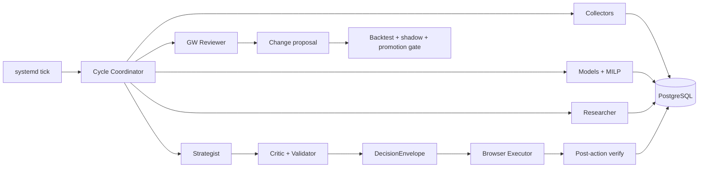

# Autonomous Harness v1

## 1. Resultado buscado

MOVA debe operar una temporada completa sin intervención rutinaria y, al mismo tiempo,
seguir siendo comprensible y manipulable por ORBIX. Para cualquier jornada, ORBIX debe
poder:

- conocer el estado real del collector, datos, modelos, equipo, research y ciclo;
- ejecutar o reintentar un paso sin repetir los demás;
- explicar qué entradas y versiones produjeron una decisión;
- estimar costo, calidad, riesgo y frescura;
- comparar una decisión con su contrafactual;
- diagnosticar y refactorizar el harness desde el repo;
- proponer, probar, promover o revertir una mejora con evidencia.

La autonomía operativa puede llegar a `A3`. La auto-modificación irrestricta no es un
objetivo: los cambios de código, schema, modelos y guardrails pasan por experimentos y
gates de promoción.

Este documento es la hoja de ruta ejecutable. Las specs 08 y 09 quedan como referencias de
hardening para cuando un riesgo real exija mayor aislamiento; no son el backlog del MVP.

## 2. Baseline confirmado — 23 de agosto de 2026

Ya existe y se conserva:

- engine/modelos FPL vivos bajo `mova_fpl/`, con MILP y horizonte rodante;
- almacén histórico canónico de 253.890 filas y 10 temporadas;
- collector oficial con snapshots sellados y cadencia por fase;
- estado privado autenticado con equipo, banco, transferencias y chips;
- control plane Docker + systemd en el VPS;
- `ops.db`, auditoría, jobs, health, incidentes, API local y backups;
- browser persistente aislado y operable por CDP;
- controles `shadow`, `A0`, `kill_switch=true`, `browser_writes=false`;
- contratos de intervención y backtest pareado del agente.

La base de desarrollo también quedó saneada antes de iniciar el harness:

- `main` contiene solo el producto FPL; legado y binarios quedaron en el tag
  `archive/pre-harness-cleanup-2026-08-23`;
- `AGENTS.md`, `pyproject.toml`, CLI instalable y CI definen una entrada reproducible;
- `pytest -q` es hermético y las pruebas con datos externos están marcadas explícitamente;
- un contrato de higiene bloquea carpetas legacy y artefactos pesados en Git.

Verificación viva del corte:

- API healthy, cinco timers activos y cero incidentes abiertos;
- GW2, deadline oficial `2026-08-28T17:30:00Z`;
- último team state válido: 15 jugadores, 1 FT, banco £0.0m y chips disponibles;
- último tick completado y correctamente omitido por cadencia;
- runtime engine `684e5da`; checkout documental del VPS `d5e9d25`;
- `main` contiene la investigación de harness hasta `4ead0e1`.

Gaps reales:

1. datos, control plane y memoria están repartidos entre SQLite y artefactos;
2. no existe una interfaz completa y estable para operar todo el sistema;
3. research/noticias no está conectado de punta a punta;
4. no existe todavía un ciclo multirol de estrategia, crítica y revisión;
5. ya existe scorecard técnico post-GW; falta atribución de decisiones y promoción de mejoras;
6. calidad de modelos ya es consultable; falta unir costos y calidad del harness completo;
7. el browser sabe leer, pero la ejecución autónoma sigue bloqueada.

## 3. Decisiones de arquitectura

### 3.1 Un orquestador, varios roles

El scheduler y la máquina de estados son código determinista. Los roles LLM son jobs
acotados, no procesos residentes ni agentes libres que se delegan tareas.

Roles iniciales:

| Rol | Responsabilidad | No puede |
| --- | --- | --- |
| Researcher | fuentes, lesiones, sanciones, roles y contexto | elegir equipo o ejecutar |
| Strategist | interpretar modelo, research y plan de temporada | saltarse MILP o reglas |
| Critic | buscar riesgos, contradicciones y alternativas | modificar la propuesta |
| Validator | combinar reglas duras y reporte crítico | inventar datos faltantes |
| Executor | aplicar un `DecisionEnvelope` aprobado | rediseñar la decisión |
| Reviewer | atribución post-GW y propuestas de mejora | promover cambios solo |

Un solo proveedor/modelo puede servir varios roles inicialmente. Separar servicios o
modelos se hace únicamente si costo, calidad o aislamiento lo justifican.

### 3.2 PostgreSQL como núcleo durable del VPS

Se desplegará un PostgreSQL local al VPS para datos analíticos, estado, memoria y ledger.
Supabase continúa siendo exclusivamente PM del proyecto.

Los artefactos pesados —modelos, HTML autorizado, manifests, reportes y capturas— permanecen
en un volumen versionado. PostgreSQL guarda metadata, relaciones, hashes y resultados
consultables.

La migración no es big bang:

1. crear PostgreSQL, migrations y backups sin tocar el runtime actual;
2. importar histórico y ledger SQLite en shadow;
3. comparar conteos, hashes, queries y decisiones en ambos stores;
4. cambiar el repository adapter a PostgreSQL;
5. conservar SQLite read-only como rollback durante tres ciclos;
6. retirar el writer SQLite después de un restore drill aprobado.

### 3.3 Una imagen de aplicación, browser separado

Stack inicial:

1. `postgres` — datos y control plane;
2. `mova-app` — API, collector, modelos, scheduler y roles agénticos;
3. `mova-browser` — sesión FPL y ejecución UI;
4. `mova-research` — worker genérico one-shot, sin DB ni secretos de datos;
5. volumen `artifacts` y destino de backups.

No habrá un contenedor por rol. Los roles deterministas corren en `mova-app`; el único worker
LLM aislado consume solicitudes selladas y devuelve candidatos por cola de archivos. Codex usa
la suscripción existente y no recibe acceso al control plane.

## 4. Capas funcionales



### 4.1 Datos y collector

- API pública, fixtures, histórico y estado privado tienen adapters separados;
- toda captura lleva `observed_at`, cutoff, source, hash, calidad y artifact ref;
- el tick evalúa cada quince minutos, pero cada collector usa cadencia por fuente y fase;
- no-cambio se registra como observación fresca sin recomputar modelos;
- schema drift, stale data, cobertura anómala o temporada incorrecta abren incidente;
- entrenamiento e inferencia son jobs distintos.

### 4.2 Analítica y modelos

Cada modelo expone contratos comunes:

- `train(dataset_release, config) -> model_release`;
- `predict(model_release, cycle_manifest) -> projection_run`;
- `explain(projection_run, subject) -> explanation`;
- `evaluate(model_release, dataset_release) -> scorecard`.

El agente puede accionar y leer estos contratos, pero no alterar predicciones en memoria.
Toda intervención entra como input versionado y se mide con/sin intervención.

### 4.3 Estado del juego y estrategia

El estado actual debe resolver en una consulta:

- plantilla, XI, banca, C/V, precio de compra/venta y banco;
- transfers libres, hits y transfers ya realizados;
- chips disponibles, gastados y ventanas;
- deadline, fase y última verificación;
- plan de temporada y plan vigente de 3–8 GWs.

La estrategia usa horizonte rodante: conserva un plan, lo compara con nueva evidencia y
explica por qué se mantiene o revisa. No reoptimiza la filosofía completa en cada tick.

### 4.4 Research con evidencia

Flujo mínimo:

`search → URL candidata → fetch seguro → documento sellado → señal → conflicto/TTL`.

El Researcher produce un acta, no una decisión. Cada señal material conserva fuente,
fecha, locator, entidad, confianza, expiración y estado de validación. Las specs 08–10 y
los schemas existentes se reutilizan solo donde aporten control real.

### 4.5 Decisión, crítica y validación

El Strategist recibe un `CycleManifest` sellado con datos, predicciones, equipo, plan,
research y memoria aceptada. Devuelve opciones y tradeoffs. El MILP sigue armando las
plantillas legales.

El Validator exige:

- datos y team state frescos;
- presupuesto, posiciones, clubes y transfer cost válidos;
- capitán, banca y chip coherentes;
- conflictos de research resueltos o explícitamente bloqueados;
- comparación contra `do_nothing` y alternativa principal;
- consistencia con el horizonte y el plan de temporada;
- hard stop, autonomía y costo dentro de policy.

### 4.6 Ejecución y verificación

El Executor recibe un `DecisionEnvelope` inmutable. Relee el estado antes de actuar,
calcula el diff exacto, aplica una vez y vuelve a leer después de guardar. Una notificación
de éxito sin estado post-acción coincidente es fallo.

Acciones por riesgo:

| Clase | Ejemplo | Política inicial | Target |
| --- | --- | --- | --- |
| R0 | leer/diagnosticar | autónoma | autónoma |
| R1 | research, modelos, propuestas | autónoma | autónoma |
| R2 | XI, banca, C/V reversibles antes del deadline | shadow/supervisada | A2 |
| R3 | transfer, hit o chip | aprobación | A3 tras gates |

## 5. PostgreSQL y artefactos

Schemas y tablas mínimas:

| Schema | Tablas núcleo |
| --- | --- |
| `raw` | `ingestion_runs`, `source_snapshots` |
| `analytics` | `player_gameweek`, `fixtures`, `dataset_releases`, `model_runs`, `predictions` |
| `game` | `cycles`, `team_snapshots`, `season_plans` |
| `research` | `runs`, `documents`, `signals` |
| `agent` | `runs`, `decision_records`, `validations`, `executions`, `gw_reviews`, `lessons`, `change_proposals` |
| `ops` | `job_runs`, `job_steps`, `controls`, `events`, `incidents`, `cost_ledger` |

Reglas:

- una migración versionada crea o cambia schema;
- `as_of` y cutoff se validan también al leer;
- append-only para decisiones, ejecuciones, reviews y controles;
- JSONB solo para payloads variables; entidades consultadas frecuentemente son columnas;
- logs completos rotan en disco; PostgreSQL conserva eventos y resúmenes, no cada línea;
- artifacts se publican por rename y hash, y se respaldan junto con PostgreSQL;
- ningún secreto, cookie o chain-of-thought entra en DB, artifacts o logs.

## 6. Memoria y mejora continua

La memoria no es historial de chat. Tiene cinco tipos explícitos:

| Memoria | Contenido | Promoción |
| --- | --- | --- |
| `season_plan` | chips, horizonte, riesgo y objetivos | nueva versión aprobada por policy |
| `decision_record` | qué se decidió, alternativas y por qué | automática por ciclo válido |
| `gw_review` | predicción vs resultado y atribución | automática post-settlement |
| `lesson` | aprendizaje reusable con evidencia | propuesta → validación |
| `change_proposal` | cambio de prompt/config/modelo/código/schema | experimento → shadow → promote |

El Reviewer separa causa probable:

- datos/frescura;
- modelo/calibración;
- optimización/constraints;
- research/contexto;
- estrategia/horizonte;
- ejecución/verificación;
- azar no accionable.

Nunca optimiza retrospectivamente contra un solo GW. Una propuesta necesita dataset,
baseline, métrica, costo, riesgo, resultado y criterio de rollback.

Niveles de cambio:

- `C0`: observación o documentación; auto-registrable;
- `C1`: prompt/config/fuente; puede probarse automáticamente en shadow;
- `C2`: modelo o código; branch/patch, tests y backtest, revisión antes de promover;
- `C3`: schema, guardrail o autonomía; aprobación explícita y restore/rollback drill.

## 7. Superficie de operación para ORBIX

Un único CLI estable, con salida humana y `--json`:

```text
mova status [--json]
mova doctor [--json] [--no-network]
mova collect [public|private|all] [--force --reason ...]
mova data inspect|freshness|coverage
mova model train|predict|explain|score
mova research run|inspect
mova cycle run|resume|inspect
mova decision inspect|compare|validate
mova execute preflight|apply|verify
mova review gw|season
mova improve propose|test|promote|rollback
mova cost report [--gw N|--month YYYY-MM]
mova logs|incidents|controls
mova backup create|verify|restore-drill
```

Cada mutación exige `actor`, `reason`, idempotency key y modo efectivo. Los comandos
destructivos o de ejecución muestran diff y policy antes de actuar.

Se crea la skill `mova-fpl-operator` como manual operativo de ORBIX. Debe explicar:

- arquitectura viva y fuentes de verdad;
- comandos y contratos JSON;
- cómo consultar Postgres sin saltarse repositories;
- cómo leer modelos, decisiones, costos y scorecards;
- diagnóstico por síntomas;
- proceso de cambio, tests, deploy y rollback;
- qué nunca debe ejecutarse automáticamente.

La skill no duplica la spec: referencia comandos versionados y runbooks cercanos al código.

## 8. Observabilidad, calidad y costos

`mova status` resume un único estado:

- próximo deadline y fase;
- edad/calidad de cada fuente;
- último dataset/modelo/predicción;
- team state y fingerprint;
- research coverage/conflicts;
- decisión y validación;
- ejecución/verificación;
- jobs fallidos, incidentes y controles;
- costo del GW y presupuesto restante.

Scorecard del harness por GW:

| Dimensión | Ejemplos |
| --- | --- |
| Reliability | jobs a tiempo, retries, incidentes, recuperación |
| Data | frescura, cobertura, drift, causalidad |
| Models | calibración, error y drift por componente |
| Research | cobertura, evidencia, conflictos y utilidad atribuida |
| Decisions | validez, regret vs alternativas y coherencia de horizonte |
| Execution | diff correcto, persistencia y duplicados |
| Cost | provider, tokens, search, CPU/duración y storage |

`ops.cost_ledger` registra provider/modelo, tokens, búsquedas, costo conocido/estimado,
duración y categoría. Hay budgets por job, GW y mes. El PostgreSQL usa el VPS existente:
no añade un proveedor pago, pero sí reserva inicialmente 0,5–0,8 GB RAM y 1–2 GB de disco.
Los costos variables de LLM/search se miden con techo explícito; Codex por suscripción se
reporta como cuota/uso, no como costo ficticio por token. La política inicial reserva 120k tokens
por job y bloquea antes de cola al superar 160k/job, 900k o 20 usos/GW y 3M o 60 usos/mes.
La reserva es transaccional, se liquida con uso real y conserva estimación ante output rechazado.

## 9. Ciclo autónomo

```text
observe
  → collect
  → qualify data
  → predict
  → research
  → propose
  → critic + validate
  → freeze
  → preflight
  → execute if policy permits
  → verify
  → settle
  → review
  → propose improvements
```

El tick descubre trabajos vencidos; no ejecuta el ciclo completo cada quince minutos. Cada
paso es idempotente, reanudable y tiene input/output hash. Un fallo detiene dependientes,
no borra evidencia previa y nunca amplía autonomía.

## 10. Roadmap implementable

| Workstream | Entrega | Estimación | Dependencia |
| --- | --- | ---: | --- |
| HV1-00 ✅ | reset del repo, archivo de legado, packaging y CI hermético | completado | baseline actual |
| HV1-01 ✅ | contrato `mova`, status/doctor y skill del operador | completado | HV1-00 |
| HV1-02 🟡 | shadow + dual-read + sync verificado; faltan 3 ciclos, off-host y cutover/rollback | 4–8 h + ciclos | HV1-01 |
| HV1-03a ✅ | collector/data quality autónomo | completado | HV1-02 |
| HV1-03b ✅ | proyección/evaluación uniforme, scorecard, drift y servicio desplegado | completado | HV1-03a |
| HV1-04 ✅ | team state, season plan y memoria estratégica longitudinal sellada | completado | HV1-02 |
| HV1-05 🟡 | servicio news/research: foco plantilla+candidatos, delta y slot final; falta evaluar cobertura multi-GW | 8–12 h | HV1-02/03 |
| HV1-06A ✅ | bundle máquina, `do_nothing`, alternativa, Validator y DecisionEnvelope | completado | HV1-03/04/05 |
| HV1-06B ✅ | Strategist + Critic acotados sobre `Intervention`, sin autoridad directa | completado | HV1-06A |
| HV1-07 🟡 | policy, apply-once, verifier y driver host de capitanía listos; faltan lineup y rehearsals | 4–8 h | HV1-06 |
| HV1-08 ✅ | reviewer causal, budgets, propuesta→lección y release de modelos con shadow/rollback | completado | HV1-03/06 |

No es necesario completar 64–92 horas antes de obtener valor. Cortes de entrega:

1. **Operable** — HV1-01: ORBIX entiende y acciona lo existente;
2. **Consolidado** — HV1-02..04: una fuente durable y memoria explícita;
3. **Strategic shadow** — HV1-05..06: actas, opciones y validación multirol;
4. **Guarded execution** — HV1-07: browser verificable según riesgo;
5. **Learning system** — HV1-08: scorecard y mejora continua controlada.

### Corte analítico implementado — 24 de agosto de 2026

La migración `005_model_analytics` añade reales oficiales por jugador, batches de proyección,
predicciones descompuestas y evaluaciones finales. `mova analytics project|reconcile|run|status`,
la API read-only, Prometheus y el timer de 30 minutos forman el contrato operativo. Cada GW mide
puntos, minutos, CS y diez componentes; drift exige seis referencias del mismo modelo/variante.

Odds permanece como señal shadow no promovida y WhoScored como research-only: el experimento
versionado encontró información defensiva parcial, pero no mejora end-to-end suficiente. Este
corte cierra observabilidad y feedback del modelo; no declara terminado el reviewer estratégico,
el reentrenamiento ni la promoción automática.

El rollout vivo quedó aprobado en la revisión `85f8873`: PostgreSQL 17 aplicó la migración 005,
la API y los seis timers quedaron saludables, y baseline + odds shadow produjeron 609
proyecciones causales para GW2. La evidencia, cobertura y criterio de rollback están en el
[acta de rollout](../../decisions/2026-27/analytics-service-rollout.md).

### Corte manual de settlement — GW1

La migración SQLite `004` y PostgreSQL `006` implementan la base mínima del Reviewer sin crear un
agente adicional: settlement factual, review con estado causal, resultados por jugador/escenario y
propuestas no autopromovibles. `mova review gw` valida la API oficial, publica artifact, exporta a
trace y deja audit/job/steps. GW1 se registró como retrospectiva porque no tuvo batch predeadline;
el scorecard causal comienza en GW2. Evidencia en
[GW1 closeout](../../decisions/2026-27/gw01-closeout.md).

### Corte strategic context + research — 27 de agosto de 2026

SQLite migration `005` añade planes versionados, manifiestos de ciclo, corridas/documentos/
conflictos de investigación y cost ledger. `mova strategy` es la fachada estable. El worker
Codex se ejecuta en un contenedor one-shot con una sola cola montada, sin PostgreSQL, secretos
de datos, repo o navegador; además se deshabilitan sus herramientas de shell y Computer Use.

El importador determinista exige evidencia HTTPS pública, identidad/hash coincidentes,
taxonomía/TTL válidos y soporte oficial o de dos fuentes para aceptar una señal. Lo demás queda
como candidato o conflicto, nunca como hecho operativo. El rollout conserva `shadow/A0`,
`kill_switch=true` y `browser_writes=false`. Evidencia y runbook:
[strategic context](../../operations/strategic-research.md).

El corte de servicio posterior eliminó el barrido genérico: el request recibe la plantilla,
hasta diez candidatos del modelo y las notas oficiales FPL, más las señales activas previas para
investigar solo deltas. La agenda conserva la rutina de seis horas y añade una corrida final
obligatoria entre T-120 y T-70; ticks sin request ya no levantan Codex. El health global permanece
visible al cambiar de jornada. Esto no implementa todavía fetch independiente/locator de cada
documento ni promoción automática de señales.

### Corte memoria estratégica longitudinal — 30 de agosto de 2026

SQLite migration `014` y PostgreSQL migration `016` añaden `memory_summary` al
`CycleManifest`. Cada `mova strategy prepare` reconstruye de manera determinista el historial
relevante: revisiones del plan, decisiones y reviews de GWs estrictamente anteriores, y lecciones
validadas no retiradas. La GW objetivo nunca se retroalimenta a sí misma y el contexto no depende
de memoria de chat.

El resumen conserva límites explícitos, cobertura, comparación entre revisiones y estados de
promoción, además de un hash propio. Strategist y Critic reciben el mismo objeto sellado;
SQLite/PostgreSQL shadow, API/status y Prometheus preservan y exponen su provenance. Un inicio de
temporada sin historia es `empty` válido; memoria ausente o inválida se observa separadamente y
no se presenta como lista para decidir.

### Corte Strategist + Critic — 28 de agosto de 2026

HV1-06B añade una deliberación hija del `DecisionEnvelope`, sin mutarlo. El mismo contenedor
one-shot procesa requests `deliberation_*`, pero en este rol no recibe web search: solo interpreta
el envelope, `CycleManifest`, plan y research ya sellados. Strategist cubre obligatoriamente los
tres comparadores y propone exclusivamente campos del contrato `Intervention`; Critic conserva
cada hard blocker por código y puede emitir `accept`, `revise` o `block`.

El importador vuelve a validar enlaces, cobertura, jugadores, multiplicadores, chips, locks,
riesgo, referencias de candidatos y blockers. Un output inconsistente queda `rejected` en
cuarentena. Toda intervención aceptada persiste con `shadow_only=true` y `applied=false`: este
corte genera evidencia y una base de atribución, pero no cambia la entrada del MILP ni amplía
autonomía. SQLite migration 008 y PostgreSQL migration 009 conservan deliberación y riesgos;
API/Prometheus exponen lifecycle y blockers.

La cadencia sigue usando un único timer de 15 minutos y procesa como máximo una request one-shot
por invocación. Researcher y Strategist/Critic comparten infraestructura, no autoridad ni prompt.
El siguiente límite arquitectónico es HV1-07: executor/verifier por clase de riesgo, sujeto a los
gates existentes y sin promover todavía la intervención del LLM.

El rollout vivo final quedó en `891ac38`: la deliberación corregida comparó los tres candidatos,
prefirió la alternativa sin chip y quedó bloqueada por los dos gates deterministas vigentes. La
validación detectó y corrigió una falsa alerta histórica de presupuesto causada por valorar una
plantilla apreciada contra las £100M iniciales. El envelope nuevo concilió precios de venta,
compras y banco; los tres candidatos quedaron sin violaciones financieras. La evidencia completa
está en [HV1-06B](17-hv1-06b-deliberation-evidence.md).

### Corte AutonomyPolicy + ExecutionPlan — 30 de agosto de 2026

HV1-07A/B separa madurez deportiva de autoridad operativa. El `DecisionEnvelope` conserva los
gates del solve, pero ya no exige permanecer en A0: un `ExecutionPlan` hijo relee manifest, team
state, deadline, incidentes, controles y ejecuciones previas; calcula el diff exacto y clasifica
`R0`, `R2` o `R3`. Solo policy determinista puede producir `authorized`.

SQLite migration 009 y PostgreSQL migrations 010/011 guardan planes/checks append-only y su
provenance de job; el import shadow los reconcilia por conteo. El CLI
`mova execute preflight`, API, Prometheus, schema JSON y runbook hacen observable cada blocker.
El rollout continúa en `shadow/A0`: este corte no inicia el browser ni amplía autoridad. El corte
HV1-07C posterior consume exclusivamente un plan autorizado y conserva apply-once/verifier;
HV1-07D debe completar el driver host y tres rehearsals antes de elevar autonomía.
Evidencia del rollout: [HV1-07A/B](18-hv1-07ab-preflight-rollout.md).

### Corte apply-once + verifier — 30 de agosto de 2026

HV1-07C implementa la mitad determinista del executor: reserva única por plan, token almacenado
como hash, lease acotado, transición explícita a `applying`, terminales fail-closed y verificación
exacta mediante GET privado posterior al reload. El command bundle R2 es inmutable y el DOM
contract usa nombres accesibles observados en la UI vigente. El tick ahora orquesta el preflight
automáticamente después de sellar cada envelope.

SQLite migration 010 y PostgreSQL shadow migration 012 conservan intentos y eventos. CLI, API,
Prometheus y artifacts permiten replay sin exponer estado privado. Un mismatch post-reload abre
P0 y queda `ambiguous`; no existe retry automático. El adapter de transfers/chips R3 y el driver
host que materializa los siete comandos siguen pendientes. Producción permanece A0 con browser
writes apagado, así que esta entrega no amplía autoridad ni toca el equipo.

El subcorte HV1-07D.2 verificó en la UI productiva los player sheets de los once titulares y sus
checkboxes accesibles `Captain`/`Vice Captain`, incluidas las selecciones actuales conciliadas con
el GET privado. El probe `2026.08.2` y `mova execute ui-plan` convierten esa evidencia en acciones
tipadas sólo después de un lease claimed. HV1-07D.3 añade el wrapper host que conserva el token en
pipe, valida antes de `begin`, hace como máximo un commit y reconcilia el GET posterior. El scope
promovido es sólo C/VC: lineup y R3 fallan cerrados, y el control real de confirmación aún exige
rehearsal. A0, kill switch y browser writes no cambiaron.

### Corte de mejora continua fail-closed — 30 de agosto de 2026

SQLite migration `011` y PostgreSQL migration `013` añaden evaluaciones idempotentes y lecciones
validadas. `mova improve` y `/api/v1/improvement` exponen propuestas, memoria y uso/costo. El gate
obliga `proposed → testing → accepted|rejected`, valida evidencia mínima y registra auditoría;
aceptar no aplica código, modelo, prompt, política ni control.

SQLite migration `012` y PostgreSQL migration `014` añaden ledger atribuido y reservas atómicas.
`mova cost report`, `/api/v1/costs` y Prometheus muestran consumo, reserva y saldo por GW/mes;
research y deliberación fallan cerrados antes de cola cuando cualquier techo se agota. Un output
rechazado conserva el cargo estimado, y un resultado recuperado lo reconcilia sin doble conteo.
El reviewer causal automático corre después de reconcile solo con settlement final y baseline
scorecard. Clasifica siete familias de causa y exige tres ocurrencias antes de crear experimento;
una sola GW queda explícitamente como evidencia insuficiente. HV1-08 permanece parcial por el
workflow que aplica un cambio aprobado mediante release, shadow y rollback verificable.
Evidencia: [HV1-08 mejora continua](21-hv1-08-improvement-rollout.md).
Rollout de límites: [HV1-08 budgets agentic](22-hv1-08-budget-rollout.md).
Rollout reviewer: [HV1-08 reviewer causal](23-hv1-08-causal-reviewer-rollout.md).

### Corte release controlado de modelos — 30 de agosto de 2026

SQLite migration `013` y PostgreSQL migration `015` añaden releases de bundles y eventos
append-only. Una propuesta aceptada puede sellar exclusivamente los artefactos `minutes+points`;
las rutas se derivan del model root y los SHA-256 se recalculan en cada transición. No existe un
executor genérico de scripts, patches, schema, prompts o controles.

`mova improve release prepare|shadow|promote|rollback|status` implementa el lifecycle real. El
analytics service proyecta el candidato como `model_release_shadow:<release_id>` sin sustituir el
baseline. La promoción exige por defecto tres scorecards finales pareados, cero alertas, MAE no
peor a 1,05× y delta p60 ECE no mayor a 0,02. El puntero `active_model_bundle` es append-only y
analytics + decisión verifican sus hashes antes de inferencia. Rollback restaura artefactos y
provenance del release previo. Este corte cierra HV1-08 sin ampliar `A0`, permisos de browser ni
autoridad de auto-modificación de código.
Evidencia: [HV1-08 release controlado de modelos](24-hv1-08-model-release-rollout.md).

### Corte dual-read PostgreSQL — 30 de agosto de 2026

El repository adapter compara contenido normalizado entre SQLite writer y PostgreSQL shadow.
Cada import audita 48 tablas exactas y el histórico canónico mediante invariantes agregados;
conteos iguales sin hashes ya no constituyen paridad. `mova postgres sync` usa una identidad
estable por ciclo/semana y el timer diario reutiliza el mismo import.

La API no recibe el secreto ni la red de datos: consume un artefacto de health sanitizado y
fail-closed con ocho días de frescura. El primer ciclo produjo 49/49 checks, restore temporal
exitoso y diagnóstico limpio. Esto completa dual-read, no el cambio de writer: HV1-02 permanece
abierto hasta acumular tres ciclos, asegurar backup off-host y ensayar cutover/rollback.
Evidencia: [HV1-02 PostgreSQL shadow y dual-read](13-hv1-02a-postgres-shadow-evidence.md).

## 11. Definition of Done del harness v1

- un ciclo completo puede ejecutarse, reanudarse y explicarse desde `mova`;
- Postgres y artifacts reconstruyen toda decisión sin depender de Supabase;
- collector, modelos, research y team state tienen health/freshness explícitos;
- cada decisión tiene alternativas, validación, plan de horizonte y costo;
- cada acción tiene preflight, diff, post-read y evidencia;
- cada GW produce review y atribución pareada;
- una mejora puede recorrer proposal → test → shadow → promote/rollback;
- ORBIX puede diagnosticar, puntuar y refactorizar usando la skill y el repo;
- tres rehearsals/GWs pasan sin duplicados ni evidencia faltante;
- la autonomía máxima se activa por clase de riesgo, no por confianza subjetiva.

## 12. No objetivos inmediatos

- LangGraph, handoffs libres o agentes residentes;
- vector DB para memoria;
- Kafka, Redis, Kubernetes, Loki o un data lake;
- un contenedor por rol;
- migrar logs crudos completos a PostgreSQL;
- cambiar el equipo mientras el sistema permanezca en `A0`;
- permitir que el Reviewer modifique producción sin evaluación.
