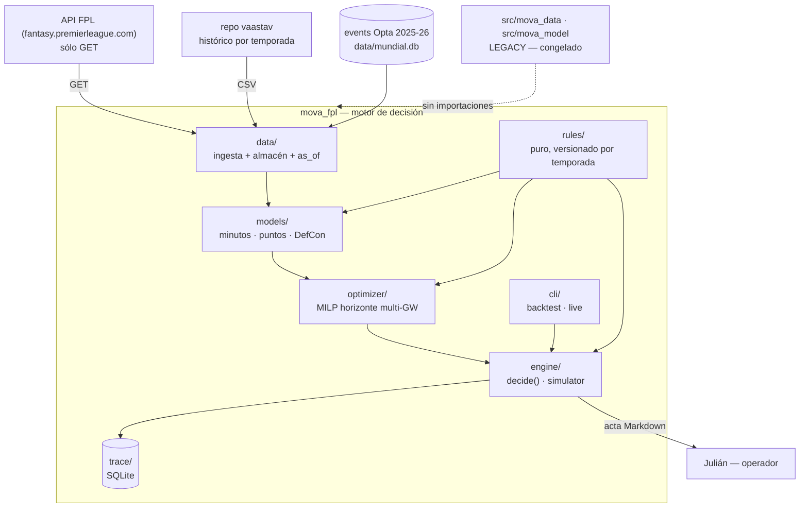
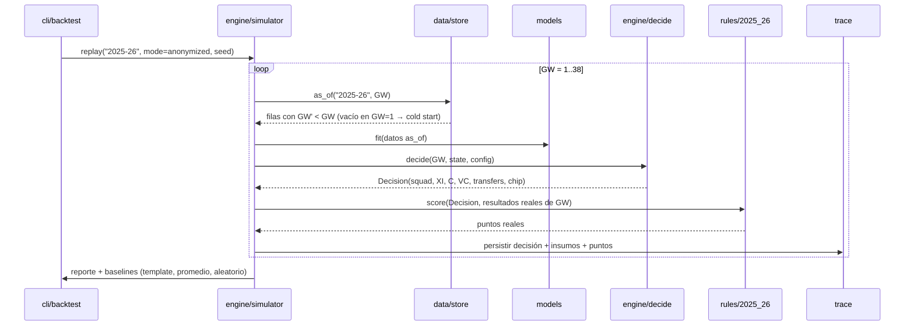

# Motor de decisión FPL 2026/27 — Architecture Spine

## Contexto y alcance

**Baseline (lo que existe hoy).** El repositorio `mova-pro-futbol-data-analytics` contiene
1,8 GB de datos deportivos válidos y un conjunto de código de modelado FPL con leakage
estructural (H-11), un optimizador de transferencias que no es MILP (H-12) y documentación
que afirma resultados no reproducibles (H-14). Los datos son buenos; el código de FPL no.

**Frontera de esta iniciativa.** Un paquete nuevo `mova_fpl/` en la rama
`feat/fpl-agent-clean`, que **lee** los datos existentes y **no importa** nada de
`src/mova_data/` ni `src/mova_model/`. Esos dos paquetes quedan congelados como legacy.

**Fuera de la frontera.** El agente LLM, la escritura a la API de FPL y el despliegue como
servicio. Ver "Fuera de alcance" en el brief.

## Drivers arquitectónicos

| Driver | Requisitos | Consecuencia de diseño |
| --- | --- | --- |
| El leakage mató el intento anterior y no se detectó por meses | REQ-F-002, REQ-Q-001 | El acceso a datos es un **contrato único** `as_of()`, no una convención. No hay otra API pública de lectura |
| Backtest y producción divergieron y el backtest dejó de probar nada | REQ-F-007, REQ-F-008 | Una sola `decide(gw, state, config)`. El harness y el runner son sólo dos proveedores de `state` |
| Las reglas cambian entre temporadas (BPS 2026/27 ≠ 2025/26) | REQ-F-003 | Reglas como funciones **puras y versionadas por temporada**, sin acceso a datos |
| DefCon es la regla nueva y es donde hay ventaja | REQ-F-005 | xP **descompuesto por componente**, cada uno con su distribución, en vez de una regresión monolítica |
| Hay 14 días y un deadline que no se mueve | todos | Walking skeleton primero: harness end-to-end con política tonta, y cada modelo se enchufa y se mide de inmediato |
| El sponsor pidió explícitamente evitar otro Frankenstein | REQ-Q-007 | Fronteras verificadas por **test de importaciones**, no por disciplina |
| Después hay que montar crons | REQ-Q-006 | `decide()` sin estado global; el estado entra como parámetro y sale como valor |

## Opciones consideradas

### Decisión 1 — Dónde vive el código nuevo

| Opción | Ventajas | Costos/riesgos | Reversibilidad |
| --- | --- | --- | --- |
| A. Refactorizar `mova_model` in situ | No duplica estructura | Arrastra el leakage y la deuda; imposible saber qué quedó limpio | Baja |
| **B. Paquete nuevo `mova_fpl/` en el mismo repo** ✅ | Limpio de cero; los 1,8 GB de datos quedan donde están; comparable contra legacy | Convive con código muerto por un tiempo | Alta |
| C. Repositorio nuevo | Máxima limpieza | Hay que mover o duplicar 1,8 GB; se pierde el histórico de datos | Media |

→ **ADR-001**

### Decisión 2 — Cómo se previene el leakage

| Opción | Ventajas | Costos/riesgos | Reversibilidad |
| --- | --- | --- | --- |
| A. Convención + revisión de código | Cero fricción | Es exactamente lo que falló antes | Alta |
| B. Auditoría posterior con tests | Detecta algo | Detecta tarde y sólo lo que se busca | Alta |
| **C. Contrato `as_of` como única vía de lectura + instrumentación en runtime** ✅ | El leakage deja de ser escribible; la violación falla en la corrida, no en review | Obliga a pasar `as_of` por la cadena completa | Media |

→ **ADR-002**

### Decisión 3 — Forma del modelo de puntos

| Opción | Ventajas | Costos/riesgos | Reversibilidad |
| --- | --- | --- | --- |
| A. Regresión única sobre `total_points` (lo que hacía el legacy) | Simple; un solo modelo | MAE engañoso: la masa está en 1–2 pts; ciega a la cola; no auditable; no aísla DefCon | Alta |
| **B. Descomposición por componente, cada uno con su distribución** ✅ | Auditable, aísla DefCon, permite calibrar por componente, explica cada decisión | Más piezas que mantener y calibrar | Media |
| C. Modelo jerárquico bayesiano completo | Incertidumbre correcta de punta a punta | No cabe en 14 días | Baja |

→ **ADR-003**

### Decisión 4 — Dónde vive la traza

| Opción | Ventajas | Costos/riesgos | Reversibilidad |
| --- | --- | --- | --- |
| A. Supabase de Orbital OS | Ya existe, consultable desde ORBIX | Es data de experimento, no de negocio; decenas de miles de filas ensucian el plano de control | Media |
| **B. SQLite dentro del proyecto** ✅ | Cero fricción, versionable, local, rápido | No sirve para multi-agente concurrente | Alta |
| C. Postgres dedicado desde el día 1 | Escala a multi-agente | Infra que hoy no se necesita | Media |

→ **ADR-005**

## Decisión recomendada

Paquete nuevo `mova_fpl/` (ADR-001) con acceso a datos por contrato `as_of` (ADR-002), xP
descompuesto por componente (ADR-003), una única función `decide()` compartida por backtest
y producción (ADR-004), traza en SQLite local (ADR-005) y alcance v1 sin agente LLM ni
escritura externa (ADR-006).

## C4 — Contexto y contenedores



**Regla de dependencias, verificada por test (REQ-Q-007):**

```
data  →  (nadie)
rules →  (nadie)              ← puro: no importa data ni models
models→  data, rules
opt   →  rules, models
engine→  data, rules, models, opt, trace
cli   →  engine
```

Cualquier arista fuera de este grafo hace fallar el test de arquitectura.

## Flujos runtime y estados

### Flujo A — Backtest walk-forward ciego



**Cold start (GW1).** `as_of("2025-26", 1)` devuelve vacío por construcción. La política de
arranque usa sólo información disponible antes de la jornada 1: precio, posición y priors
de temporadas anteriores. Esto es idéntico a la situación real del 21 de agosto — es el
motivo por el que el backtest es un simulacro válido y no sólo una métrica.

### Flujo B — Decisión en vivo

Mismo `decide()`. Cambia el proveedor de `state`: en vez del simulador, un adaptador que
lee el bootstrap de la API de FPL y el estado real del equipo. La salida no se puntúa
inmediatamente (los partidos no han ocurrido); se persiste y se reconcilia después.

### Errores, timeouts, reintentos, idempotencia

| Situación | Comportamiento |
| --- | --- |
| Fuente HTTP caída o lenta | Reintento con backoff (máx 5). Si falla, se usa el último snapshot en caché y **el acta lo declara explícitamente** |
| Ingesta parcial | Escritura atómica a archivo temporal y `mv` sólo si la validación de cabecera pasa. Nunca deja un CSV a medias |
| Ingesta repetida | Idempotente por `(season, GW, element)`; re-ejecutar no duplica |
| Corrida de backtest interrumpida | La traza registra por gameweek; se reanuda desde la última jornada persistida |
| Optimizador infactible | Falla ruidosamente con el conjunto de restricciones violadas. **Nunca** relaja una restricción en silencio |
| Modelo sin datos suficientes | Cae al prior declarado y lo marca en la traza. No inventa |

### Estados

- Corrida: `running → completed | failed | interrupted`
- Decisión de gameweek: `projected → committed → reconciled`

## Datos y consistencia

| Entidad | Owner | Clave | Ciclo de vida |
| --- | --- | --- | --- |
| `player_gameweek` | `data/store` | (season, GW, element) | Append-only. Nunca se actualiza una fila histórica |
| `fixture` | `data/store` | (season, fixture_id) | Refrescable: reprogramaciones son normales |
| `defensive_actions` | `data/store` | (match_id, player) | Derivado de eventos Opta. Recomputable |
| `agent_run` | `trace` | run_id | Inmutable al cerrar |
| `gw_decision` | `trace` | (run_id, GW) | `projected → committed → reconciled` |
| `model_version` | `trace` | (name, version) | Inmutable; git sha obligatorio |

**Reglas de consistencia.** El almacén es la única fuente de verdad para entrenamiento. La
traza nunca se edita retroactivamente: una corrección genera una corrida nueva. Los
artefactos de modelo se registran con git sha; un modelo sin sha no es utilizable en
producción.

**Cobertura conocida y declarada** (H-05, H-06, I-01): las columnas defensivas sólo existen
en 2016-17→2018-19 y en 2025-26; xG sólo desde 2022-23. El almacén guarda `NULL` donde no
hay dato — nunca `0` — y publica una matriz de cobertura por temporada y columna. Los
modelos declaran qué temporadas pueden usar.

## Contratos e interfaces

```python
# data/store.py — ÚNICA vía de lectura
def as_of(season: str, gw: int, columns: list[str] | None = None) -> DataFrame: ...
def coverage() -> DataFrame            # matriz temporada × columna
def fixtures(season: str, gw_from: int, gw_to: int) -> DataFrame

# rules/<season>.py — puro, sin I/O
def score(stats: PlayerStats) -> PointsBreakdown
def validate_squad(squad: Squad) -> list[Violation]      # [] == válido
def auto_subs(squad: Squad, minutes: dict) -> Squad
def transfer_cost(n_transfers: int, free: int) -> int

# models/ — reciben datos ya recortados por as_of
class MinutesModel:  fit(df) ; predict_proba(df) -> [p0, p1_59, p60]
class PointsModel:   fit(df) ; project(df, horizon) -> DataFrame  # con desglose

# optimizer/milp.py
def solve(state: SquadState, projections: DataFrame,
          horizon: int, rules: RulesModule) -> Decision

# engine/runner.py — LA función
def decide(gw: int, state: State, config: Config) -> Decision
```

**Compatibilidad.** `Decision` es un dataclass serializable y versionado; el harness y el
runner consumen la misma estructura. Un cambio de forma de `Decision` obliga a versionar la
traza.

## Seguridad, privacidad y trust boundaries

Modalidad `standard`. No hay PII, no hay dinero, no hay datos de clientes: sólo
estadísticas deportivas públicas.

| Activo | Frontera | Control |
| --- | --- | --- |
| Cuenta FPL de Julián | Externa, no gestionada por v1 | **REQ-S-002**: sólo `GET`. Test que falla ante cualquier otro verbo |
| Repositorio | Pública (GitHub OrbitalLabBOG) | **REQ-S-001**: sin secretos; v1 no consume credenciales |
| Datos de terceros | `vaastav` (público), API FPL (público), Opta ya recolectado | Uso analítico interno. No se redistribuyen |

**Riesgo residual aceptado:** los eventos Opta provienen de scraping previo (H-09). No se
amplía esa recolección en esta iniciativa y no se republican los datos.

## Observabilidad y operación

- **Traza estructurada** por corrida y gameweek (REQ-F-010) — es el mecanismo primario.
- **Reporte de cobertura** de datos en cada ingesta: filas por temporada y nulos por columna.
- **Reporte de calibración** por componente del modelo.
- **Invariantes en runtime**: la instrumentación de `as_of` corre siempre, no sólo en tests.
- **Runbook** mínimo: cómo re-correr una gameweek, cómo reanudar un backtest interrumpido,
  qué hacer si la API de FPL no responde antes de un deadline.

Sin alertas ni dashboards en v1: no hay servicio desplegado.

## Despliegue, migración y rollback

- **Ambiente:** local, Python conda 3.13.5. No hay despliegue en v1.
- **Migración:** ninguna. Es código nuevo junto a código congelado; nada existente cambia de
  comportamiento.
- **Rollback:** la rama `feat/fpl-agent-clean` se puede abandonar sin efecto sobre `main`.
  Por workpack, cada uno define su propio rollback.
- **Legacy:** `src/mova_data/`, `src/mova_model/`, `scripts/train_fpl_*`, `scripts/sim_*`,
  `live_agent_runner.py` y `docs/16..20` se marcan deprecados con nota que apunta a este
  paquete. No se borran en v1 — borrarlos es una decisión separada.

## Costos y capacidad

| Recurso | Estimación | Límite |
| --- | --- | --- |
| Datos en disco | ~50 MB adicionales (10 CSVs) sobre 1,8 GB existentes | — |
| Entrenamiento por gameweek | Segundos a decenas de segundos (GBDT sobre ~250K filas) | REQ-Q-006: ciclo total ≤ 10 min |
| Backtest completo | 38 reentrenamientos por corrida | Debe caber en una sesión de trabajo |
| Costo monetario | **$0** — todas las fuentes son gratuitas y no hay LLM en v1 | — |

## Riesgos y deuda aceptada

| Riesgo | Impacto | Mitigación | Owner | Estado |
| --- | --- | --- | --- | --- |
| R-01 El plan estimado (~80 h) no cabe en 14 días | Se llega a GW1 sin motor | Walking skeleton temprano; corte declarado el 18-ago: si WP-006 no está, se juega GW1 con optimizador de horizonte 1 | Julián | open |
| R-02 `rules_2026_27` no es validable contra ground truth (C-01) | Puntuación mal implementada en producción | Golden test valida `2025_26`; el diff `2025_26 → 2026_27` se revisa línea por línea contra la fuente oficial | Julián | aceptado |
| R-03 DefCon se entrena con una sola temporada (C-02) | Componente con alta varianza | Se reporta el componente por separado con su incertidumbre; no se le da peso ciego | Julián | open |
| R-04 El backtest sobreestima bonus por el cambio de BPS (C-03) | Expectativa inflada | Se reporta el desglose de bonus por separado para acotar el sesgo | Julián | aceptado |
| R-05 Cold start en GW1: sin datos de 2026/27, la primera decisión es la más débil | Mal arranque de temporada | El backtest mide exactamente este caso (GW1 ciego) y da una expectativa honesta antes del 21-ago | Julián | open |
| R-06 `vaastav` deja de actualizar durante la temporada (S-01) | Sin datos frescos | Fallback a la API oficial de FPL, que sirve la gameweek en curso | Julián | open |
| R-07 Red inestable en la descarga de fuentes | Ingesta incompleta | Descarga idempotente con reintentos y validación de cabecera; ya observado en la práctica | Julián | mitigado |
| R-08 Q-02 sin responder deja abierta la función objetivo (C-04) | El optimizador puede optimizar lo que no es | **Bloqueo declarado para WP-006.** Default: maximizar puntos esperados | Julián | open |
